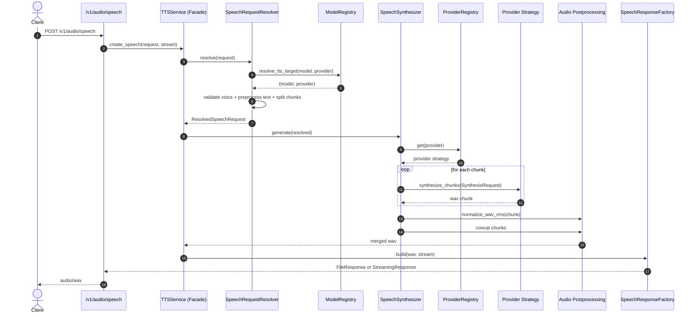

# llm-tts-api

OpenAI-compatible local audio API (FastAPI) with a modular TTS pipeline and pluggable providers.

## What This Service Does

- Exposes OpenAI-like endpoints under `/v1`.
- Generates speech with `POST /v1/audio/speech`.
- Supports multiple TTS providers behind a single service contract:
  - `mlx_audio`
  - `voxtral`
  - `vllm-omni`
- Loads voice cloning metadata from a JSON voice map.
- Preprocesses text for better prosody and language stability.
- Post-processes each generated WAV chunk with RMS normalization.
- Streams audio or returns a temporary file response.

## Architecture And Design Choices

The refactor applies explicit patterns to keep the codebase maintainable:

- **Facade**: `TTSService` exposes one coherent entry point for speech creation.
- **Strategy**: provider implementations in `services/tts_providers/` share one contract.
- **Registry**: `TTSProviderRegistry` resolves provider names to strategy instances.
- **Pipeline**: request flow is split into preprocessing -> generation -> post-processing.
- **Fail-fast configuration**: `Settings` validates env and voice map at startup.
- **Dependency injection**: FastAPI dependencies provide singleton services.

## Speech Pipeline (Detailed)

### 1) Preprocessing

Implemented in `src/llm_tts_api/services/text_preprocessing.py`:

- punctuation cleanup:
  - collapses duplicate punctuation and spaces
  - removes noisy line-break punctuation artifacts
- date expansion:
  - converts `dd/mm/yyyy` into spoken words (language-aware)
- number expansion:
  - converts standalone integers using `num2words`
- semantic chunking:
  - splits by sentence boundaries
  - respects `TTS_MAX_INPUT_CHARS`
  - enforces per-voice `max_sentences_per_chunk`

### 2) Processing (Synthesis)

Implemented in `src/llm_tts_api/services/tts_service.py` and provider strategies:

- resolve provider and model through `ModelRegistry`
- validate voice from `TTS_VOICE_MAP_FILE`
- pass `GenerationOptions` to provider (`language`, `temperature`, `top_p`)
- synthesize chunk-by-chunk through strategy interface

### 3) Post-processing

Implemented in `src/llm_tts_api/services/audio_postprocessing.py`:

- per-chunk RMS normalization to target dB (`target_db` in voice config)
- chunk-safe WAV concatenation with strict parameter compatibility checks
- stream or file response creation with automatic temp file cleanup

## Endpoints

### Implemented

- `GET /health`
- `GET /ready`
- `GET /v1/models`
- `POST /v1/audio/speech`

### Stubbed (returns `501`)

- `POST /v1/audio/transcriptions`
- `POST /v1/audio/translations`
- voice consent / voice enrollment endpoints
- chat endpoints under `/v1/chat/...`
- realtime endpoints under `/v1/realtime/...`

## Request Flow Sequence Diagram



## Project Structure

- `src/llm_tts_api/config.py`: validated runtime settings and voice map parsing.
- `src/llm_tts_api/dependencies.py`: singleton dependency factories.
- `src/llm_tts_api/services/tts_service.py`: orchestration facade + internal pipeline components.
- `src/llm_tts_api/services/text_preprocessing.py`: input normalization/chunking.
- `src/llm_tts_api/services/audio_postprocessing.py`: loudness normalization.
- `src/llm_tts_api/services/tts_providers/`: provider strategies and shared argument helpers.
- `src/llm_tts_api/routers/`: API routes.
- `tests/`: unit and integration tests.

## Install

```bash
python -m venv .venv
source .venv/bin/activate
pip install -U pip
pip install -e ".[dev]"
```

## Run

```bash
uvicorn llm_tts_api.main:app --host 0.0.0.0 --port 8000 --workers 1
```

```bash
python -m llm_tts_api.main
```

```bash
llm-tts-api
```

## Configuration

### App

- `APP_NAME` (default: `llm-tts-api`)
- `APP_ENV` (default: `development`)
- `APP_LOG_LEVEL` (default: `INFO`)

### Provider routing

- `TTS_PROVIDER` (default: `mlx_audio`)
- `TTS_MLX_AUDIO_MODEL_DEFAULT`
- `TTS_MLX_AUDIO_MODEL_ALLOWED` (csv)
- `TTS_VOXTRAL_MODEL_DEFAULT`
- `TTS_VOXTRAL_MODEL_ALLOWED` (csv)
- `TTS_VLLM_OMNI_MODEL_DEFAULT`
- `TTS_VLLM_OMNI_MODEL_ALLOWED` (csv)

### Limits

- `TTS_MAX_INPUT_CHARS` (default: `4096`, minimum `256`)
- `TTS_MAX_CONCURRENT_REQUESTS` (default: `1`)

### Voice map

- `TTS_VOICE_MAP_FILE` (required)

Voice entry fields:

- `ref_audio_path`: path to cloning reference audio
- `ref_text`: optional reference transcript
- `language`: synthesis language label
- `number_lang`: optional language override for date/number expansion
- `temperature`: generation temperature
- `top_p`: generation top-p
- `target_db`: normalization target RMS in dB
- `max_sentences_per_chunk`: semantic split limit

Example:

```json
{
  "gold": {
    "ref_audio_path": "/absolute/path/to/gold.wav",
    "ref_text": "Ciao, questa e una voce di riferimento.",
    "language": "Italian",
    "number_lang": "it",
    "temperature": 0.8,
    "top_p": 0.95,
    "target_db": -20.0,
    "max_sentences_per_chunk": 2
  }
}
```

## Example `.env.local`

```bash
APP_NAME=llm-tts-api
APP_ENV=development
APP_LOG_LEVEL=DEBUG

TTS_PROVIDER=mlx_audio
TTS_MLX_AUDIO_MODEL_DEFAULT=Qwen/Qwen3-TTS-12Hz-0.6B-Base
TTS_MLX_AUDIO_MODEL_ALLOWED=Qwen/Qwen3-TTS-12Hz-0.6B-Base,Qwen/Qwen3-TTS-12Hz-1.7B-Base
TTS_VOXTRAL_MODEL_DEFAULT=mlx-community/Voxtral-4B-TTS-2603-mlx-4bit
TTS_VOXTRAL_MODEL_ALLOWED=mlx-community/Voxtral-4B-TTS-2603-mlx-4bit
TTS_VLLM_OMNI_MODEL_DEFAULT=vllm-omni/default-tts
TTS_VLLM_OMNI_MODEL_ALLOWED=vllm-omni/default-tts

TTS_MAX_INPUT_CHARS=4096
TTS_MAX_CONCURRENT_REQUESTS=1
TTS_VOICE_MAP_FILE=./config/voice_map.local.json
```

## Quick Request Example

```bash
curl -X POST "http://localhost:8000/v1/audio/speech" \
  -H "Content-Type: application/json" \
  -d '{
    "model": "Qwen/Qwen3-TTS-12Hz-0.6B-Base",
    "provider": "mlx_audio",
    "voice": "gold",
    "input": "Il 15/04/2026 abbiamo 2 appuntamenti.",
    "response_format": "wav"
  }' \
  --output speech.wav
```

## Testing

```bash
pytest -q
```

## Key Files To Read First

- `src/llm_tts_api/services/tts_service.py`
- `src/llm_tts_api/services/text_preprocessing.py`
- `src/llm_tts_api/services/audio_postprocessing.py`
- `src/llm_tts_api/services/tts_providers/voice_args.py`
- `src/llm_tts_api/config.py`
