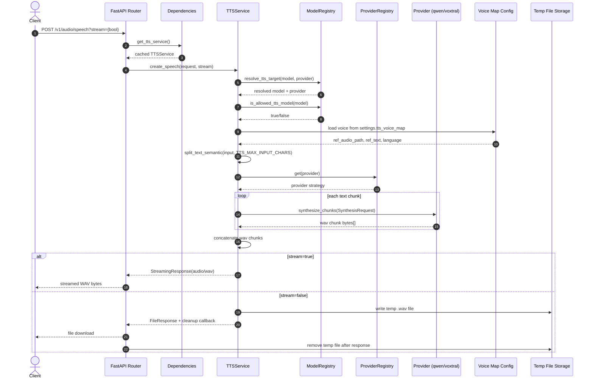

# llm-tts-api

OpenAI-compatible local audio API built with FastAPI and pluggable TTS providers, currently focused on local MLX-backed generation flows.

## Core Features

- OpenAI-style endpoint surface under `/v1`.
- Text-to-speech generation via `POST /v1/audio/speech`.
- Provider strategy routing (`qwen`, `voxtral`) with dynamic model/provider resolution.
- Voice cloning through reference voice map metadata.
- Fail-fast startup preload of default TTS model.
- Automatic semantic chunking for long text input.
- Stream and non-stream response modes.
- Strict validation for model allow-lists and voice configuration.

## Why The Main Choices Were Made

- **OpenAI-compatible contract**: lets clients switch backends without rewriting business logic.
- **Provider registry pattern**: isolates provider-specific code and keeps API layer stable.
- **Startup preload fail-fast**: catches missing dependencies/model loading issues before traffic.
- **Voice map file**: avoids hardcoding voice references in code and supports environment-specific deployment paths.
- **Chunked synthesis**: reduces per-request risk and keeps long narration payloads reliable.

## Endpoint Status

### Implemented

- `GET /health`
- `GET /ready`
- `GET /v1/models`
- `POST /v1/audio/speech`

### Compatibility stubs (`501 not_implemented`)

- `POST /v1/audio/transcriptions`
- `POST /v1/audio/translations`
- `POST /v1/audio/voices`
- `GET/POST /v1/audio/voice_consents`
- `GET/POST/DELETE /v1/audio/voice_consents/{consent_id}`
- Chat routes under `/v1/chat/completions...`
- Realtime routes under `/v1/realtime...`

## Project Structure

- `src/llm_tts_api/`: application package.
- `src/llm_tts_api/routers/`: API route handlers.
- `src/llm_tts_api/services/`: model registry, TTS service, provider strategies.
- `src/llm_tts_api/services/tts_providers/`: provider implementations.
- `config/`: environment and voice map examples.
- `voices/`: local reference voice audio samples.
- `tests/`: unit/integration tests.

## Install

```bash
python -m venv .venv
source .venv/bin/activate
pip install -U pip
pip install -e ".[dev]"
```

## Run Modes

The app auto-loads `.env` and `.env.local` during startup.

```bash
uvicorn llm_tts_api.main:app --host 0.0.0.0 --port 8000 --workers 1
```

```bash
python -m llm_tts_api.main
```

```bash
llm-tts-api
```

## Configuration Reference

### App

- `APP_NAME` (default: `llm-tts-api`)
- `APP_ENV` (default: `development`)
- `APP_LOG_LEVEL` (default: `INFO`)

### TTS routing

- `TTS_DEFAULT_PROVIDER` (default: `qwen`)
- `TTS_MODEL_DEFAULT` (default: `Qwen/Qwen3-TTS-12Hz-0.6B-Base`)
- `TTS_MODEL_ALLOWED` (csv)
- `TTS_PROVIDER_MODEL_PREFIXES` (JSON)

### Limits

- `TTS_MAX_INPUT_CHARS` (default: `4096`, must be `>= 256`)
- `TTS_MAX_CONCURRENT_REQUESTS` (default: `1`)
  - In-process synthesis concurrency limit; keep `1` for MLX/Metal stability

### Voice map

- `TTS_VOICE_MAP_FILE` (required)

### STT placeholders

- `STT_MODEL_DEFAULT`
- `STT_MODEL_ALLOWED`

## Example `.env.local`

```bash
APP_NAME=llm-tts-api
APP_ENV=development
APP_LOG_LEVEL=DEBUG

TTS_DEFAULT_PROVIDER=voxtral
TTS_MODEL_DEFAULT=mlx-community/Voxtral-4B-TTS-2603-mlx-4bit
TTS_MODEL_ALLOWED=mlx-community/Voxtral-4B-TTS-2603-mlx-4bit,Qwen/Qwen3-TTS-12Hz-0.6B-Base
TTS_PROVIDER_MODEL_PREFIXES={"voxtral":["voxtral/","mistral/","mistralai/","mlx-community/"],"qwen":["qwen/"]}

TTS_MAX_INPUT_CHARS=4096
TTS_VOICE_MAP_FILE=./config/voice_map.local.json

STT_MODEL_DEFAULT=whisper-1
STT_MODEL_ALLOWED=whisper-1
```

## Model and Provider Resolution Logic

For `POST /v1/audio/speech`:

1. Resolve `model` from request or `TTS_MODEL_DEFAULT`.
2. Resolve `provider`:
   - explicit request provider wins,
   - else infer by model prefix,
   - else fallback to `TTS_DEFAULT_PROVIDER`.
3. Validate model against `TTS_MODEL_ALLOWED`.
4. Resolve voice from `TTS_VOICE_MAP_FILE`.
5. Chunk text (`TTS_MAX_INPUT_CHARS`) and dispatch provider synthesis.

## Speech Request Notes

### Body fields

- `model`
- `provider` (optional)
- `input`
- `voice`
- `response_format` (`wav` only)
- `instructions` (accepted and forwarded where supported)
- `speed` (accepted by schema)
- `stream_format` (accepted by schema)

### Query

- `stream` (`true` or `false`)

## Voice Map Schema

Each voice key requires:

- `ref_audio_path`
- `ref_text`
- `language`

Example:

```json
{
  "gold": {
    "ref_audio_path": "/absolute/path/to/voices/gold.wav",
    "ref_text": "Ciao, questa e una voce di riferimento per il clonaggio.",
    "language": "Italian"
  }
}
```

## Detailed Sequence Diagram (`/v1/audio/speech`)



## Request Examples

```bash
curl -X POST "http://localhost:8000/v1/audio/speech" \
  -H "Content-Type: application/json" \
  -d '{
    "model": "Qwen/Qwen3-TTS-12Hz-0.6B-Base",
    "provider": "qwen",
    "voice": "gold",
    "input": "Ciao, questo e un test.",
    "response_format": "wav"
  }' --output speech_qwen.wav
```

```bash
curl -X POST "http://localhost:8000/v1/audio/speech?stream=true" \
  -H "Content-Type: application/json" \
  -d '{
    "model": "mlx-community/Voxtral-4B-TTS-2603-mlx-4bit",
    "provider": "voxtral",
    "voice": "gold",
    "input": "Hello, this is a Voxtral streaming synthesis test.",
    "response_format": "wav"
  }' --output speech_voxtral_stream.wav
```

## Operational Notes

- For MLX stability, prefer controlled concurrency and avoid unsafe shared model execution patterns.
- Startup intentionally preloads the default model and fails fast if preload fails.
- Use `APP_LOG_LEVEL=DEBUG` for HTTP and provider-level tracing.

---

## Run tests

```bash
python -m pytest -q tests
```

---

## Useful files

- `examples.http` request collection
- `config/voice_map.example.json` starter template
- `src/llm_tts_api/config.py` runtime settings and validation
- `src/llm_tts_api/services/model_registry.py` model/provider resolution
- `src/llm_tts_api/services/tts_service.py` speech orchestration
- `src/llm_tts_api/services/tts_providers/` provider strategies
