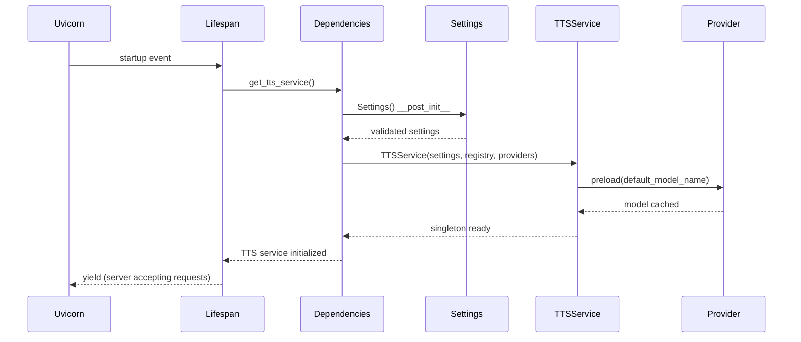
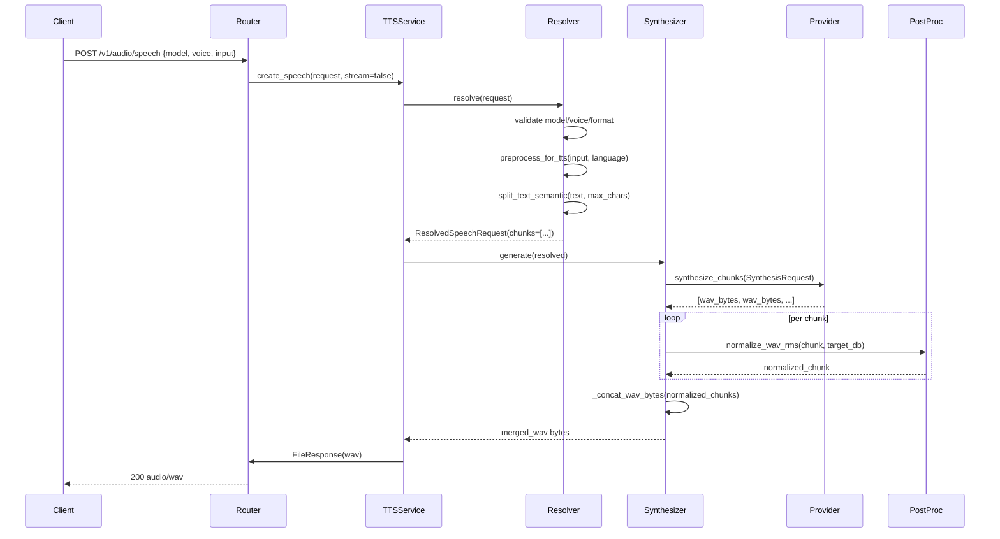
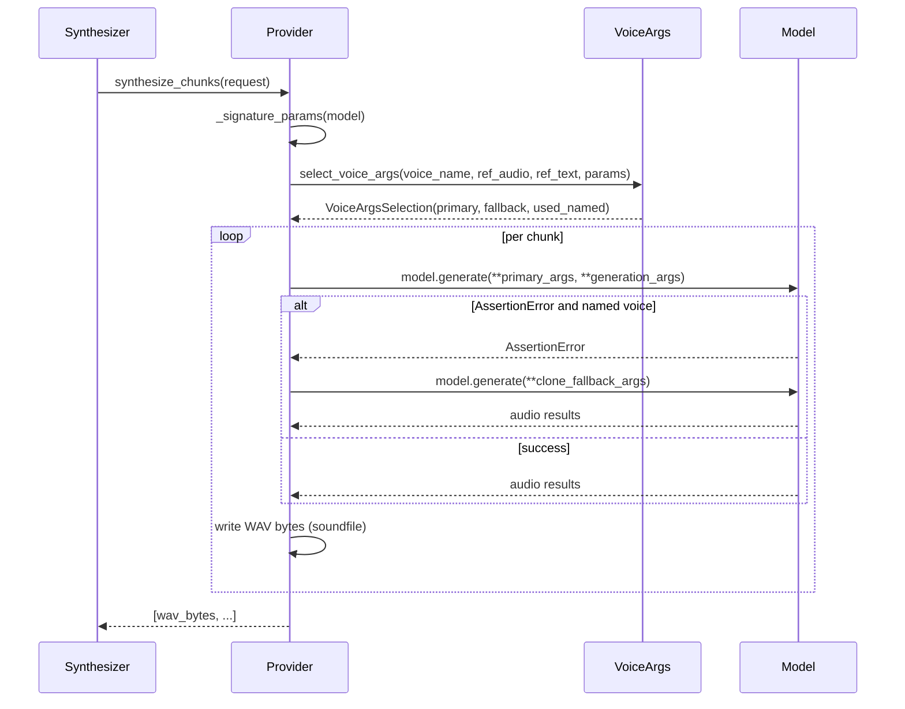
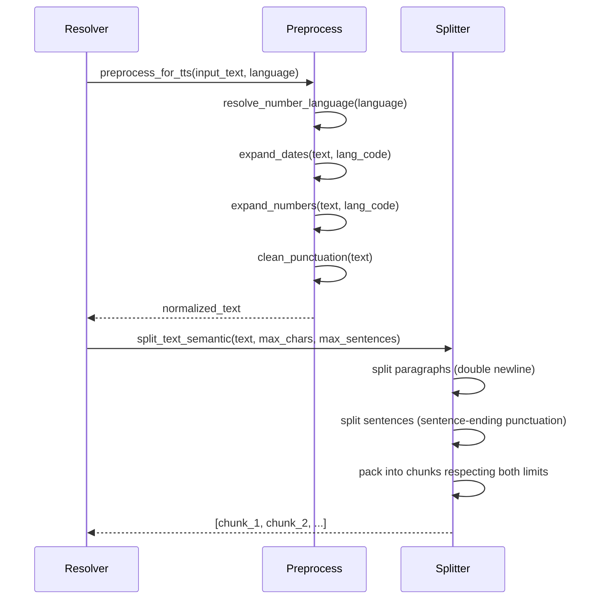
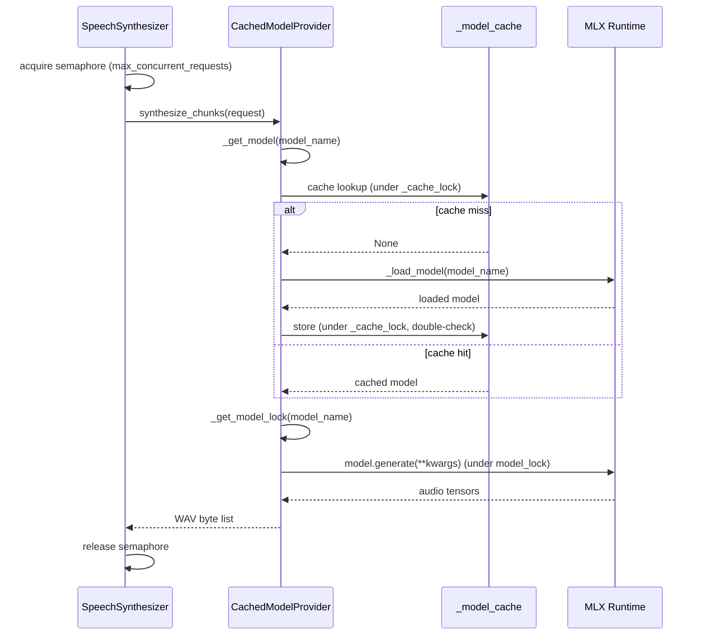
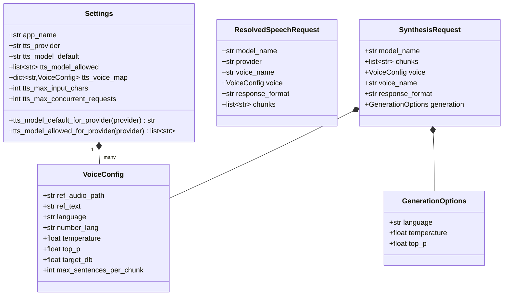
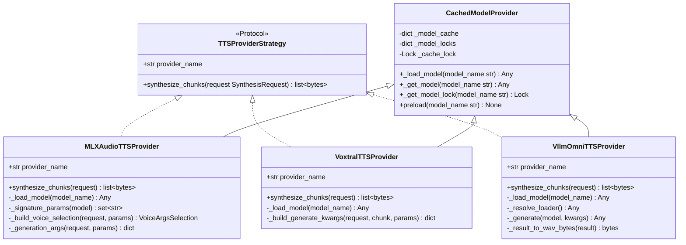
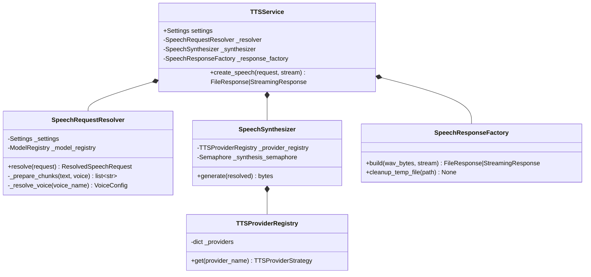
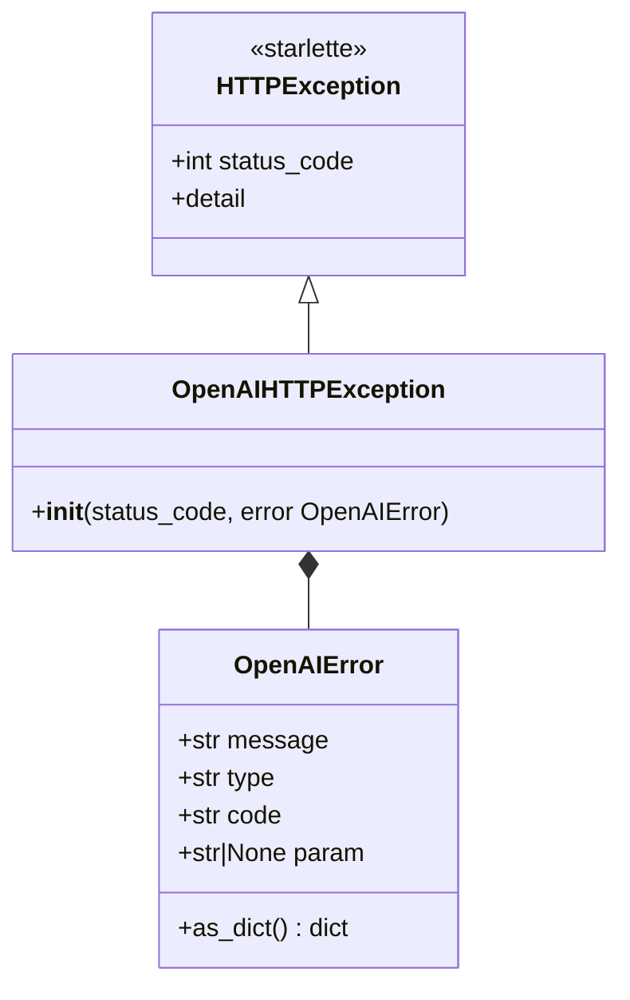

# llm-tts-api — Architecture Documentation

## System Overview

`llm-tts-api` is an OpenAI-compatible REST API server for local text-to-speech (TTS) synthesis.
It exposes the same `/v1/audio/speech` contract as the OpenAI Audio API, allowing any consumer
that already speaks the OpenAI SDK (including `audiobook-generator`) to use it as a drop-in local
backend with no client code changes.

The server is built on **FastAPI** and supports three local TTS backends: `mlx_audio` (Qwen-family
models via Apple MLX), `voxtral` (Voxtral 4B via MLX), and `vllm-omni` (generic vllm-omni
compatible backends). All backends are wrapped by a common **Strategy** protocol, and the active
backend is selected at startup via the `TTS_PROVIDER` environment variable.

The pipeline inside each speech request is: validate → preprocess text → chunk text →
synthesize chunks → normalize per-chunk loudness → concatenate chunks → return WAV response.
All configuration — including the voice map, model selection, and concurrency limits — is loaded
once at startup by `Settings` and propagated downward as typed values, with no further
environment variable reads in service or provider code.

## Layer Map

```
┌─────────────────────────────────────────────────────┐
│                   HTTP Layer                        │
│  FastAPI app  ·  routers/  ·  exception handlers    │
│  audio.py  chat.py  health.py  models.py  realtime  │
└────────────────────────┬────────────────────────────┘
                         │ depends on
┌────────────────────────▼────────────────────────────┐
│               Application Layer                     │
│  dependencies.py (lru_cache singletons)             │
│  TTSService  ·  SpeechRequestResolver               │
│  SpeechSynthesizer  ·  SpeechResponseFactory        │
└──────────┬──────────────────────┬───────────────────┘
           │                      │
┌──────────▼──────┐   ┌───────────▼───────────────────┐
│  Domain / Core  │   │  Infrastructure / Providers   │
│  Settings       │   │  MLXAudioTTSProvider           │
│  VoiceConfig    │   │  VoxtralTTSProvider            │
│  SynthesisReq   │   │  VllmOmniTTSProvider           │
│  GenerationOpts │   │  CachedModelProvider (base)    │
│  TTSProviderReg │   │  TTSProviderRegistry           │
└─────────────────┘   └───────────────────────────────┘
```

---

## Sequence Diagrams

### Flow 1 — Application Startup

At startup, the FastAPI lifespan hook calls `dependencies.get_tts_service()`. The dependency
module constructs `Settings` (reading all env vars exactly once), `ModelRegistry`,
`TTSProviderRegistry` (with all three provider instances), and finally `TTSService`. During
`TTSService` construction, the default TTS provider model is preloaded into memory by calling
`provider.preload(model_name)`. If the model download or load fails here, the server exits before
accepting any requests — a fail-fast approach that prevents latent misconfiguration.

The `lru_cache(maxsize=1)` decorators on each dependency factory ensure that all singletons are
constructed exactly once and shared across every request for the server's lifetime. FastAPI's DI
system calls these factories per request but the cache makes them effectively singletons.



**Walkthrough:**
- `Uvicorn → Lifespan`: uvicorn fires the ASGI lifespan startup event
- `Lifespan → Dependencies`: calls the DI singleton factory for TTSService
- `Dependencies → Settings`: constructs Settings, reading all env vars (TTS_PROVIDER, TTS_VOICE_MAP_FILE, TTS_MAX_CONCURRENT_REQUESTS, etc.)
- `Settings → Dependencies`: returns validated, typed configuration object
- `Dependencies → TTSService`: passes settings + ModelRegistry + TTSProviderRegistry to TTSService constructor
- `TTSService → Provider`: calls `preload(model)` on the default provider so the first real request doesn't pay the cold-start cost
- `Provider → TTSService`: model is loaded into `CachedModelProvider._model_cache`
- Lifespan yields, uvicorn starts accepting connections

---

### Flow 2 — Speech Request (POST /v1/audio/speech)

A typical speech request enters the router, is handed to `TTSService.create_speech`, validated
by `SpeechRequestResolver`, chunked, synthesized chunk-by-chunk under a concurrency semaphore,
normalized, concatenated, and returned as a WAV file or streaming response.

The semaphore in `SpeechSynthesizer` (bounded by `settings.tts_max_concurrent_requests`) prevents
multiple heavy synthesis calls from running simultaneously on the same ML runtime, which would
cause out-of-memory errors on Apple Silicon. The per-model lock inside `CachedModelProvider`
further serializes calls that share the same model instance.



**Walkthrough:**
- `Client → Router`: HTTP POST with JSON body containing model ID, voice name, and input text
- `Router → TTSService`: delegates to the singleton TTS service; `stream` flag from query param
- `TTSService → Resolver`: calls `SpeechRequestResolver.resolve()` to validate and normalize
- `Resolver → Resolver (validate)`: checks model is in allow-list, voice exists in voice map, format is wav
- `Resolver → Resolver (preprocess)`: `preprocess_for_tts` cleans punctuation, expands dates/numbers
- `Resolver → Resolver (chunk)`: `split_text_semantic` splits text at sentence/paragraph boundaries
- `Resolver → TTSService`: returns frozen `ResolvedSpeechRequest` with chunk list
- `TTSService → Synthesizer`: delegates synthesis under the concurrency semaphore
- `Synthesizer → Provider`: `synthesize_chunks` runs the TTS model on each chunk inside a per-model lock
- `Provider → Synthesizer`: returns one WAV bytes payload per chunk
- `Synthesizer (loop) → PostProc`: `normalize_wav_rms` scales each chunk to the per-voice `target_db`
- `Synthesizer → Synthesizer`: `_concat_wav_bytes` stitches all normalized chunks into one WAV
- `Synthesizer → TTSService`: returns merged WAV bytes
- `TTSService → Router`: `SpeechResponseFactory.build` creates a temp-file `FileResponse`
- `Router → Client`: 200 response with `audio/wav` content-type

---

### Flow 3 — Voice Cloning Resolution

Providers support two voice modes: **named voice** (model has a built-in speaker, selected by
name string) and **reference audio cloning** (user provides a WAV file and optional transcript).
`VoiceArgsSelection` abstracts this choice so providers don't need to inspect configuration
directly. `select_voice_args` inspects the model's `generate` signature via `inspect.signature`
to discover which parameter names the model supports, then maps from canonical names to the
model's actual parameter names.

If a provider tries the named-voice path but the model raises `AssertionError` (a common failure
mode for models that don't support named voices), the provider falls back to clone-mode args if
available — this retry is handled inside each provider's `synthesize_chunks` implementation.



**Walkthrough:**
- `Synthesizer → Provider`: calls `synthesize_chunks` with the frozen `SynthesisRequest`
- `Provider → Provider`: `_signature_params` reflects the model's `generate` method to get supported parameter names
- `Provider → VoiceArgs`: `select_voice_args` chooses primary args (clone preferred) and stores fallback clone args
- `VoiceArgs → Provider`: `VoiceArgsSelection` with `primary_args`, `clone_fallback_args`, `used_named_voice` flag
- `Provider → Model`: calls `model.generate(**primary_args, text=chunk, **generation_args)`
- `Model → Provider (error path)`: if named voice is unsupported, model raises `AssertionError`
- `Provider → Model (retry)`: retries with `clone_fallback_args` if named voice failed and clone args exist
- `Provider → Provider`: writes audio tensor to WAV bytes via `soundfile.write`
- `Provider → Synthesizer`: list of WAV byte payloads, one per chunk

---

### Flow 4 — Text Preprocessing Pipeline

Before any synthesis occurs, raw user input passes through a deterministic preprocessing
pipeline that improves prosody and prevents common model mispronunciation artifacts.
Dates are expanded to spoken words (`"3/5/2026"` → `"tre maggio duemilaventisei"`), standalone
numbers become words, and punctuation is normalized to remove duplicates and fix spacing.

The text is then semantically split into chunks that fit within the model's maximum input size
(`TTS_MAX_INPUT_CHARS`, default 4096). Splitting respects paragraph and sentence boundaries,
grouping up to `voice.max_sentences_per_chunk` sentences together for more natural prosody.
Oversized single sentences are hard-sliced as a last resort.



**Walkthrough:**
- `Resolver → Preprocess`: calls `preprocess_for_tts` with raw input and voice language setting
- `Preprocess → Preprocess (lang)`: `resolve_number_language` normalizes language label to a `num2words` code
- `Preprocess → Preprocess (dates)`: regex finds `dd/mm/yyyy` patterns and replaces with spoken-word equivalents
- `Preprocess → Preprocess (numbers)`: standalone digits are converted to words using `num2words`
- `Preprocess → Preprocess (punct)`: duplicate punctuation, leading/trailing whitespace, and newlines after punctuation are normalized
- `Preprocess → Resolver`: cleaned, normalized text with no TTS-hostile tokens
- `Resolver → Splitter`: calls `split_text_semantic` with the cleaned text, char limit, and per-voice sentence grouping
- `Splitter → Splitter (paragraphs)`: splits on double newlines to preserve paragraph structure
- `Splitter → Splitter (sentences)`: each paragraph is split on terminal punctuation (`[.!?…]`)
- `Splitter → Splitter (pack)`: sentences are greedily grouped while respecting both `max_chars` and `max_sentences_per_chunk`
- `Splitter → Resolver`: list of text chunks, each safe to send as a single TTS request

---

### Flow 5 — Model Cache and Concurrency

Local TTS models are large (hundreds of MB to several GB). `CachedModelProvider` implements a
double-checked-lock cache pattern to ensure each model is loaded at most once even under
concurrent requests. A per-model `threading.Lock` serializes all synthesis calls against the
same model, preventing MLX from attempting concurrent GPU/CPU kernel execution. The semaphore
in `SpeechSynthesizer` provides a higher-level bound on overall parallel requests, enforced
before the provider is even called.



**Walkthrough:**
- `Synth → Synth`: `SpeechSynthesizer` acquires the `threading.Semaphore` — at most `tts_max_concurrent_requests` requests run simultaneously
- `Synth → Cache`: delegates to the concrete provider (MLX/Voxtral/vllm-omni) which extends `CachedModelProvider`
- `Cache → ModelStore (lookup)`: reads `_model_cache` under `_cache_lock` for a fast path check
- `ModelStore → Cache (miss)`: if no cached entry, proceeds to load
- `Cache → MLX (load)`: calls `_load_model` which imports and calls `mlx_audio.tts.utils.load`
- `MLX → Cache`: returns loaded model object
- `Cache → ModelStore (store)`: re-acquires lock, double-checks cache before inserting (race-safe)
- `Cache → Cache (model lock)`: gets the per-model `Lock` to serialize further generate calls
- `Cache → MLX (generate)`: calls `model.generate` under the per-model lock
- `MLX → Cache`: audio tensor results
- `Cache → Synth`: list of WAV byte payloads
- `Synth → Synth`: releases semaphore, allowing the next queued request to proceed

---

## Class Diagrams

### Domain Models



### Port Interfaces



### Application Layer



### Error Hierarchy



---

## Data Flow Summary

```
HTTP Request
     │
     ▼
[FastAPI Router]
  audio.py: POST /v1/audio/speech
     │
     ▼
[TTSService.create_speech]
     │
     ├──▶ [SpeechRequestResolver.resolve]
     │         ├── validate model/voice/format
     │         ├── preprocess_for_tts(input, language)
     │         │       expand_dates · expand_numbers · clean_punctuation
     │         └── split_text_semantic(text, max_chars, max_sentences)
     │
     ├──▶ [SpeechSynthesizer.generate] (under semaphore)
     │         ├── TTSProviderRegistry.get(provider)
     │         ├── provider.synthesize_chunks(request) (under model lock)
     │         │       CachedModelProvider._get_model → model.generate
     │         └── normalize_wav_rms(chunk, target_db) per chunk
     │
     └──▶ [SpeechResponseFactory.build]
               ├── stream=True  → StreamingResponse(io.BytesIO)
               └── stream=False → FileResponse(tmp_file) + cleanup task

HTTP Response: 200 audio/wav
```

---

## Key Design Decisions

| Decision | Rationale |
|----------|-----------|
| OpenAI-compatible API contract | Allows `audiobook-generator` and other existing OpenAI SDK clients to use the local server with zero code changes |
| Strategy pattern for TTS providers | New backends (e.g. llama.cpp TTS) can be added without touching service or routing code |
| `Settings` as sole env-var boundary | All configuration is read once at startup and propagated as typed values; service and provider code is testable without env patching |
| Per-model threading.Lock inside CachedModelProvider | MLX runtime is not thread-safe; serializing per model prevents GPU memory corruption while still allowing different models to run concurrently |
| Semaphore in SpeechSynthesizer | Hard-limits concurrent heavyweight synthesis calls; prevents Apple Silicon OOM when multiple clients request speech simultaneously |
| Text preprocessing at API level | Punctuation cleanup, number/date expansion, and semantic chunking benefit any consumer of the API, not just audiobook use cases; keeping them in the API avoids duplication |
| WAV-only output format | Lossless format chosen for the concatenation pipeline; MP3 frames cannot be naively concatenated. Future formats can be added post-processing |
| `frozen=True` on all domain value objects | Prevents accidental mutation inside provider implementations and makes objects safe to share across threads |