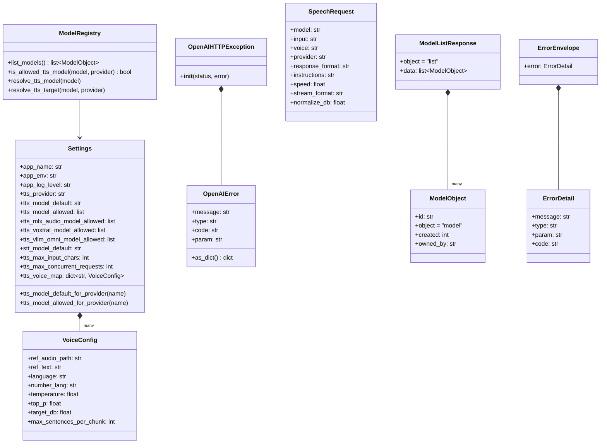

# llm-tts-api — Configuration, Errors & Schemas

## Purpose
Captures the static data model of the service: environment-driven `Settings`, per-voice `VoiceConfig`, the OpenAI-compatible request/response Pydantic schemas, and the OpenAI-shaped error envelope.

## Participants
- `Settings`, `VoiceConfig` — `src/llm_tts_api/config.py:9-249`
- `ModelRegistry` — `src/llm_tts_api/services/model_registry.py:7-41`
- `OpenAIError`, `OpenAIHTTPException`, factories — `src/llm_tts_api/errors.py:9-75`
- Request/response schemas — `src/llm_tts_api/schemas/{speech,models,transcription,common}.py`
- DI singletons — `src/llm_tts_api/dependencies.py`

## Narrative
`Settings` is constructed once (cached by `dependencies.get_settings` with `lru_cache`) on first request. Its `__post_init__` runs all `_load_*` methods in order: app identity, provider models, STT models, TTS limits, then the voice map loaded from `TTS_VOICE_MAP_FILE`. The voice map produces `VoiceConfig` instances (one per named voice) holding the reference-audio path, reference text, language, generation hyperparameters and target RMS.

`ModelRegistry` is a thin facade over `Settings` exposing model/provider validation and listing for the `/v1/models` endpoint.

Errors flow through `OpenAIHTTPException`, which carries an `OpenAIError` payload serialized under `{"error": {...}}` — matching the OpenAI API shape. The `invalid_request`, `not_implemented`, and `internal_error` helpers in `errors.py` are the only places these are constructed.

The schema layer is the public contract: `SpeechRequest` (POST body), `ModelListResponse` (GET /v1/models), and placeholder transcription schemas. `ErrorEnvelope` wraps `ErrorDetail` for all error responses.

## Diagram

## Notes
- All Settings fields are loaded from env vars (`TTS_*`, `APP_*`, `STT_*`). See `Settings._load_provider_models` for the per-provider model allow-list pattern.
- `VoiceConfig.ref_audio_path` must exist on disk; verified by `SpeechRequestResolver._resolve_voice` at request time, not at startup.
- The DI module wires `get_settings → get_model_registry → get_tts_service` as a singleton chain via `lru_cache(maxsize=1)`.
