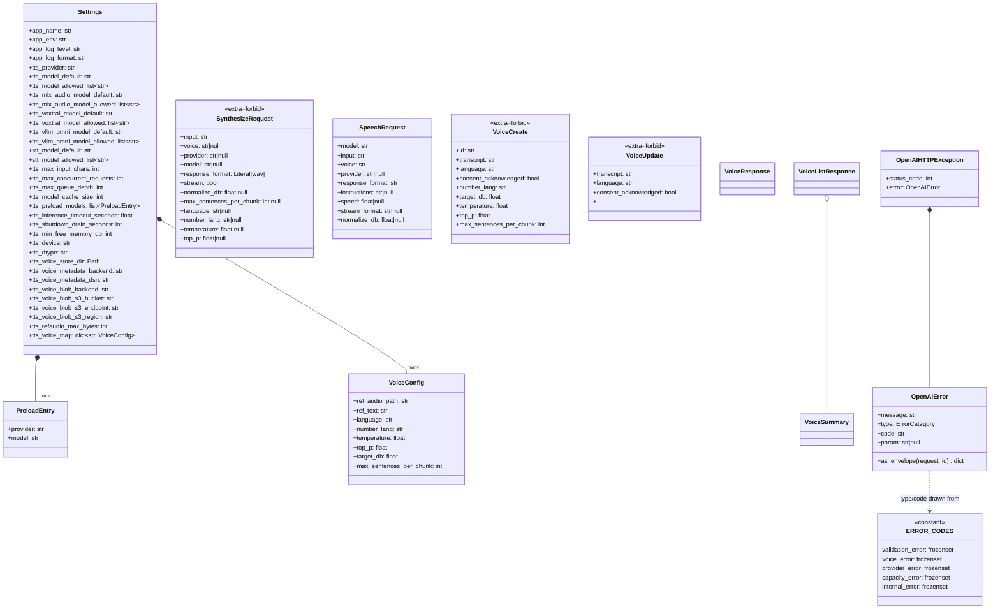

# llm-tts-api — Configuration, Errors & Schemas

## Purpose
Captures the static data model of the post-Sprint-5 service: `Settings` (env-driven), per-voice `VoiceConfig`, the rich `SynthesizeRequest` Pydantic schema, the OpenAI-compatible `SpeechRequest`, the voice-CRUD `Voice*` schemas, and the typed OpenAI-shaped error envelope.

## Participants
- `Settings`, `VoiceConfig`, `PreloadEntry` — `src/llm_tts_api/config.py`
- `ModelRegistry`, `ModelCache` — `src/llm_tts_api/services/{model_registry,model_cache}.py`
- `OpenAIError`, `OpenAIHTTPException`, `ERROR_CODES`, factories — `src/llm_tts_api/errors.py`
- Request schemas — `schemas/{speech,synthesis,voices,models,common}.py`
- DI singletons — `src/llm_tts_api/dependencies.py`

## Narrative
`Settings` is constructed once at lifespan startup (via `build_default_dependencies`). `__post_init__` runs `_load_app_identity → _load_provider_models → _load_stt_models → _load_tts_limits → _load_runtime_knobs → _load_voice_store_dir → _load_voice_metadata_backend → _load_voice_blob_backend → _load_int(TTS_REFAUDIO_MAX_BYTES) → _load_voice_map_from_file`. The full env-var inventory is enumerated in the README and pinned by `tests/test_docs_inventory.py`.

The rich endpoint accepts `SynthesizeRequest` (`extra="forbid"`); the OpenAI adapter accepts `SpeechRequest` and translates it field-by-field into `SynthesizeRequest` before delegating to `synthesize_core`. Voice-CRUD uses `VoiceCreate` / `VoiceUpdate` (multipart `metadata` part) and emits `VoiceResponse` / `VoiceSummary` / `VoiceListResponse`.

Errors flow through `OpenAIHTTPException` carrying an `OpenAIError`. The `ERROR_CODES` constant in `errors.py` declares the closed set of types (`validation_error`, `voice_error`, `provider_error`, `capacity_error`, `internal_error`) and the documented sub-codes. The handler renders the envelope (with the active request id) and sets `X-Error-Code` (FR-ER-03).

## Diagram

## Notes
- `Settings.__post_init__` validates every env var fail-fast at startup — typos and out-of-range values raise `ValueError` with the env-var name in the message.
- The `tests/test_docs_inventory.py` test walks `config.py` via AST and asserts the README documents every env var; same test walks `ERROR_CODES` and asserts each `(type, code)` is in the README.
- `SynthesizeRequest` and `VoiceCreate` both pin `extra="forbid"` (NFR-MT-04) so unknown fields surface as `validation_error.invalid_parameter` rather than being silently dropped.
- The `request_id` field of the envelope is injected at render time by `openai_exception_handler` (via the S-004 contextvar) — call sites don't thread the id manually.
