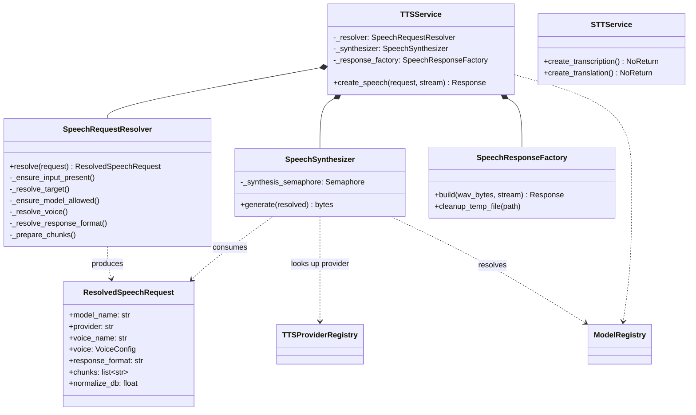

# llm-tts-api — Service Overview

## Purpose
High-level class structure for the TTS request pipeline. `TTSService` is the facade injected into the audio router; internally it composes three single-responsibility collaborators: validate/normalize the request, synthesize WAV bytes, then wrap the result in an HTTP response.

## Participants
- `TTSService` — `src/llm_tts_api/services/tts_service.py:244-297` (facade, preloads default model in `__init__`)
- `SpeechRequestResolver` — `tts_service.py:101-181`
- `SpeechSynthesizer` — `tts_service.py:184-216` (owns the bounded-concurrency `asyncio.Semaphore`)
- `SpeechResponseFactory` — `tts_service.py:219-241`
- `ResolvedSpeechRequest` — `tts_service.py:33-43` (DTO between resolver and synthesizer)
- `STTService` — `src/llm_tts_api/services/stt_service.py` (placeholder, raises 501)
- Router entry points — `src/llm_tts_api/routers/audio.py`, `routers/health.py`, `routers/models.py`

## Narrative
The router builds a `SpeechRequest` Pydantic model and hands it to `TTSService.create_speech`. The service delegates in three phases:

1. **Resolve** — `SpeechRequestResolver` validates input presence, resolves model/provider/voice through the `ModelRegistry`, selects the response format, preprocesses text (punctuation, numbers, dates) and splits it into chunks via `split_text_semantic`. Result: a `ResolvedSpeechRequest`.
2. **Synthesize** — `SpeechSynthesizer.generate` acquires a class-level semaphore (bounded concurrent generations), looks the provider up in the `TTSProviderRegistry`, asks it to synthesize each chunk, normalizes each chunk's RMS via `normalize_wav_rms`, then concatenates them into a single WAV.
3. **Respond** — `SpeechResponseFactory.build` either streams the bytes back (`StreamingResponse`) or writes them to a temp file (`FileResponse` with a `BackgroundTask` cleanup).

The placeholder routers (`chat.py`, `realtime.py`, voice-consent endpoints in `audio.py`) all raise `OpenAIHTTPException(501)` via `errors.not_implemented` and are not modelled here.

## Diagram

## Notes
- The provider lookup detail is in [providers.md](providers.md).
- The end-to-end runtime sequence is in [../sequence/create-speech.md](../sequence/create-speech.md).
- `STTService` is shown because it is wired through `get_stt_service` but currently 501s every endpoint.
