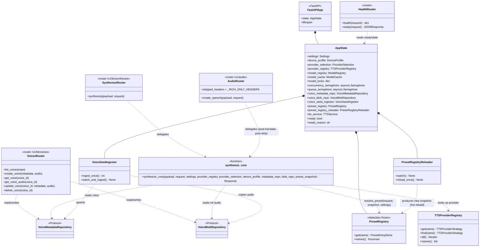

# llm-tts-api — Service Overview

## Purpose
Top-level composition of the post-Sprint-5 service. The rich endpoint (`POST /v1/tts/synthesize`) and the OpenAI adapter (`POST /v1/audio/speech`) both delegate to the single service-layer entry point `services/synthesize_service.synthesize_core` (BR-9, NFR-PT-03b). The voice store sits behind two Protocols (see [voice-store.md](voice-store.md)); the provider layer is auto-selected from the `DeviceProfile` (see [providers.md](providers.md)).

## Participants
- `create_app`, lifespan — `src/llm_tts_api/main.py:136-227`
- DI getters — `src/llm_tts_api/dependencies.py`
- `synthesize_core` (the single synthesis pipeline) — `src/llm_tts_api/services/synthesize_service.py`
- Router handlers — `routers/{health,models,audio,synthesize,voices,chat,realtime}.py`
- `Settings`, `VoiceConfig` — `config.py`
- `TTSProviderRegistry`, `ProviderSelection`, `DeviceProfile` — `services/tts_providers/`
- `ModelCache`, `ModelRegistry` — `services/`
- `VoiceMetadataRepository`, `VoiceBlobRepository`, `VoiceSeedIngestor` — `services/voice_store/`

## Narrative
The FastAPI lifespan constructs every collaborator once via `build_default_dependencies` and stashes them on `app.state`. Routers receive them through `Annotated[..., Depends(get_*)]`. The `ready` flag flips True only after the seed-ingestion pass runs (so a startup `GET /v1/tts/voices` already reflects the seed file). On shutdown the flag flips False first, the seed watcher task is cancelled, and `_drain_concurrency` waits up to `TTS_SHUTDOWN_DRAIN_SECONDS` for in-flight synthesis to release the concurrency semaphore.

`routers/synthesize.py` (rich) and `routers/audio.py` (OpenAI) are both **thin wrappers** over `synthesize_core`. The rich router passes the raw `SynthesizeRequest`; the OpenAI router maps `SpeechRequest → SynthesizeRequest` first and then strips the `X-Provider` / `X-Model` / `X-Device` / `X-Dtype` / `X-Voice-Source` / `X-Voice-Id` / `X-Chunks` / `X-Total-Duration-Ms` headers from the response so the OpenAI shape stays byte-identical (FR-OA-01..03; NFR-PT-03b paired UAT). The handlers MUST NOT import each other's internals — `tests/test_openai_adapter.py` enforces this with a static check.

## Diagram

## Notes
- One synthesis pipeline (BR-9). The S-017 unification removed `SpeechSynthesizer` / `SpeechRequestResolver` / `SpeechResponseFactory` from the OpenAI path; the same `_RICH_ONLY_HEADERS` constant in `routers/audio.py` lists exactly which response headers are stripped.
- `_drain_concurrency` (in `main.py`) waits passively on the semaphore counter rather than re-acquiring (which would race with a queued waiter).
- Schemas + error envelope: [config-and-schemas.md](config-and-schemas.md).
- Voice-store details: [voice-store.md](voice-store.md). Provider strategy details: [providers.md](providers.md).
- Runtime sequences: [../sequence/startup.md](../sequence/startup.md), [../sequence/synthesize-rich.md](../sequence/synthesize-rich.md), [../sequence/create-speech.md](../sequence/create-speech.md), [../sequence/voice-crud.md](../sequence/voice-crud.md), [../sequence/voice-seed-ingestion.md](../sequence/voice-seed-ingestion.md), [../sequence/preset-resolution.md](../sequence/preset-resolution.md), [../sequence/preset-hot-reload.md](../sequence/preset-hot-reload.md).
- Preset class shape: [presets.md](presets.md) — `PresetConfig`, `PresetEntry`, `PresetDefaults` (HF-2 expansion: `language` / `number_lang` / `voice`), `PresetRegistry`, resolver, reloader.
