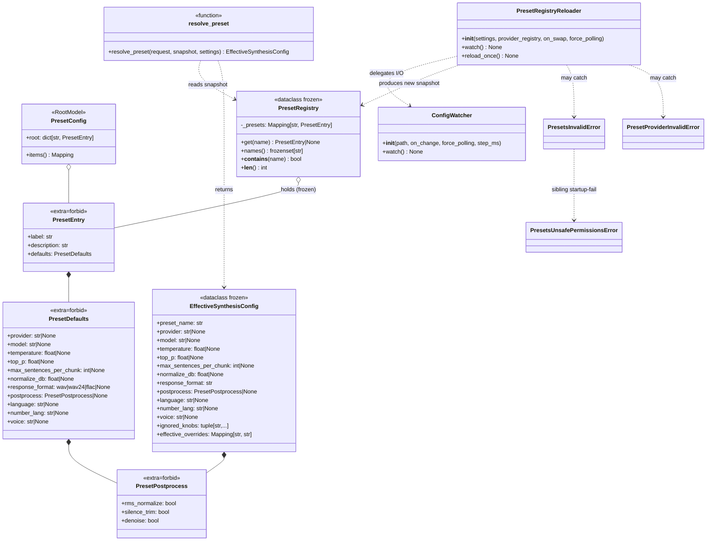

# llm-tts-api — Audio preset registry (cycle-2)

## Purpose
Static data model of the cycle-2 preset surface (S-027, S-028, S-029, plus HF-2 schema expansion). Captures the schema that parses `config/presets.json`, the frozen registry snapshot stashed on `app.state.preset_registry`, the request-time resolver, and the hot-reload loop. The companion sequence diagram is [`../sequence/preset-resolution.md`](../sequence/preset-resolution.md); the hot-reload loop is [`../sequence/preset-hot-reload.md`](../sequence/preset-hot-reload.md).

## Participants
- `PresetConfig`, `PresetEntry`, `PresetDefaults`, `PresetPostprocess`, `PresetRegistry`, `load_preset_registry`, `validate_preset_providers`, `check_presets_file_permissions` — `src/llm_tts_api/services/presets/config.py`
- `_allow_lists_from_settings`, `bootstrap_preset_registry` — `src/llm_tts_api/services/presets/startup.py`
- `PresetRegistryReloader` — `src/llm_tts_api/services/presets/reloader.py`
- `EffectiveSynthesisConfig`, `resolve_preset`, `_format_preset_effective_header` — `src/llm_tts_api/services/synthesize_service.py`
- `get_preset_registry_snapshot` — `src/llm_tts_api/dependencies.py`
- `ConfigWatcher` — `src/llm_tts_api/services/config_watcher.py`

## Narrative
The lifespan parses `TTS_PRESETS_FILE` exactly once via `load_preset_registry`, then runs `check_presets_file_permissions` (NFR-SE-09) and `validate_preset_providers` (FR-PR-13). The resulting frozen `PresetRegistry` is stored on `app.state.preset_registry`. The reloader (`PresetRegistryReloader`) re-runs the schema + provider checks on every file change and atomically swaps the slot on success; on any failure it logs WARN with the `config_error.*` code and keeps the prior registry live (NFR-SE-10).

At request time the FastAPI dependency `get_preset_registry_snapshot` reads `app.state.preset_registry` **once** at request entry and passes the same snapshot through the entire call. `resolve_preset(request, snapshot, settings)` reads only its three arguments — never `app.state` — so a mid-flight hot-reload swap cannot tear the resolution (NFR-PR-04 in-flight snapshot invariant).

HF-2 expanded `PresetDefaults` with three semantic-layer fields (`language`, `number_lang`, `voice`) so that a preset can supply the voice itself — clients hitting the rich endpoint with `{"input": ..., "preset": "audiobook_it"}` and nothing else are no longer rejected with `voice_required` (FR-PR-03).

## Diagram

## Notes
- `PresetRegistry` is `@dataclass(frozen=True, slots=True)`. The hot-reload path never mutates an existing registry — it builds a new one and rebinds `app.state.preset_registry`. The request-scoped `Depends(get_preset_registry_snapshot)` captures the slot value once per request, so in-flight resolutions are tear-free (NFR-PR-04).
- `validate_preset_providers` only checks presets that pin **provider** explicitly. A preset that pins only `model` defers validation to runtime, because the auto-selected provider may legitimately differ from one host class to another.
- `check_presets_file_permissions` is intentionally startup-only (RISK-PR-3). The hot-reload path accepts the documented `mv` + `chmod` race window — an attacker who can flip permissions also has shell access on the host, which is a strictly larger threat surface than the cycle-2 control compensates for.
- The OpenAI adapter (`/v1/audio/speech`) strips `X-Preset-Effective` + `X-Preset-Ignored-Knobs` from its response so the wire shape stays OpenAI-identical (NFR-PT-03b / NFR-PT-05 paired UAT pinned in `tests/test_openai_adapter_parity.py`).
- Related: error envelope + Settings shape in [`config-and-schemas.md`](config-and-schemas.md); top-level wiring in [`overview.md`](overview.md).
