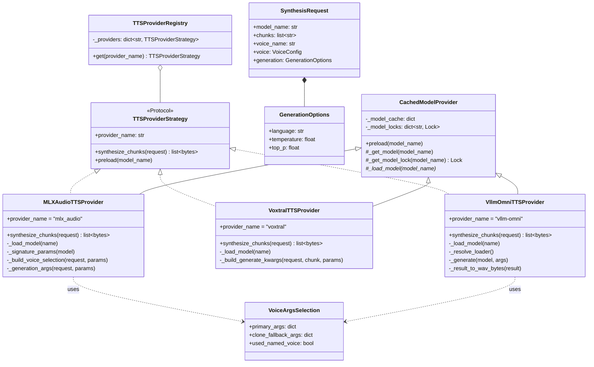

# llm-tts-api — Provider Strategy

## Purpose
The TTS engine layer is decoupled from the service layer behind the `TTSProviderStrategy` Protocol. Three concrete strategies plug in via the `TTSProviderRegistry`, share a common lazy-loading base in `CachedModelProvider`, and use the `voice_args` module to convert user-facing voice configuration into engine-specific kwargs.

## Participants
- `TTSProviderStrategy` (Protocol) — `services/tts_providers/base.py:30-37`
- `GenerationOptions`, `SynthesisRequest` — `base.py:10-27`
- `TTSProviderRegistry` — `services/tts_providers/registry.py:7-22`
- `CachedModelProvider` — `services/tts_providers/cached_model_provider.py:7-49`
- `MLXAudioTTSProvider` — `services/tts_providers/mlx_audio_provider.py:20-115`
- `VoxtralTTSProvider` — `services/tts_providers/voxtral_provider.py:16-93`
- `VllmOmniTTSProvider` — `services/tts_providers/vllm_omni_provider.py:21-199`
- `VoiceArgsSelection` + helpers — `services/tts_providers/voice_args.py:14-101`

## Narrative
`CachedModelProvider` owns the model cache and per-model `threading.Lock`. Each concrete provider:

1. Subclasses `CachedModelProvider` and implements `_load_model` to call the engine's loader.
2. Implements `synthesize_chunks(SynthesisRequest) -> list[bytes]`, which:
   - Looks up the cached model + lock,
   - Inspects the underlying `model.generate` signature to discover supported kwargs,
   - Builds voice args via `voice_args.select_voice_args` and generation args via `build_generation_args`,
   - Iterates over text chunks, calls `model.generate`, encodes each result to WAV bytes via `soundfile.write`.

**Per-provider policy differences:**
- `MLXAudioTTSProvider` — supports both reference-audio cloning and named voices, with a clone fallback on `AssertionError`.
- `VoxtralTTSProvider` — cloning-only; raises `invalid_request` if `ref_audio_path` is missing.
- `VllmOmniTTSProvider` — most permissive: voice optional, multiple loader import paths, flexible payload decoding (`_result_to_wav_bytes` handles raw bytes / dict / object shapes).

`voice_args.select_voice_args` encapsulates the precedence: prefer voice-cloning args (ref_audio + ref_text) over named-voice args, returning a `VoiceArgsSelection` whose `clone_fallback_args` is used when the primary attempt fails.

## Diagram

## Auto-selection capability matrix (S-006)

`dependencies.build_default_dependencies` constructs the `DeviceProfile` from `TTS_DEVICE` (default `auto`) and feeds it to `select_provider(device_profile, registry, override=TTS_PROVIDER)`. The first registered provider whose `supports_devices` contains the detected device wins; `TTS_PROVIDER` overrides auto-selection but is still validated against the device.

| Provider    | `supports_devices` | Auto-picked on            | `TTS_PROVIDER` override valid on | If chosen with incompatible device                       |
|-------------|--------------------|---------------------------|----------------------------------|----------------------------------------------------------|
| `mlx_audio` | `{mps}`            | Apple Silicon (MPS)       | `mps`                            | `provider_error.no_viable_provider` at startup           |
| `voxtral`   | `{mps}`            | Apple Silicon (MPS)       | `mps`                            | `provider_error.no_viable_provider` at startup           |
| `vllm-omni` | `{cuda}`           | CUDA hosts                | `cuda`                           | `provider_error.no_viable_provider` at startup           |

`ProviderSelection.source` records whether the choice came from auto-detection (`"auto"`) or from the env override (`"env"`); the `/health` endpoint surfaces it as `provider_source` so operators can confirm which path picked the active provider.

## Notes
- Per-provider runtime sequences: [mlx-audio](../sequence/provider-mlx-audio.md), [voxtral](../sequence/provider-voxtral.md), [vllm-omni](../sequence/provider-vllm-omni.md).
- Adding a new provider = (a) subclass `CachedModelProvider`, (b) declare `supports_devices`, (c) register it in `dependencies.build_default_dependencies` (order = priority for auto-selection), (d) add an env-driven model allow-list in `Settings._load_provider_models`.
