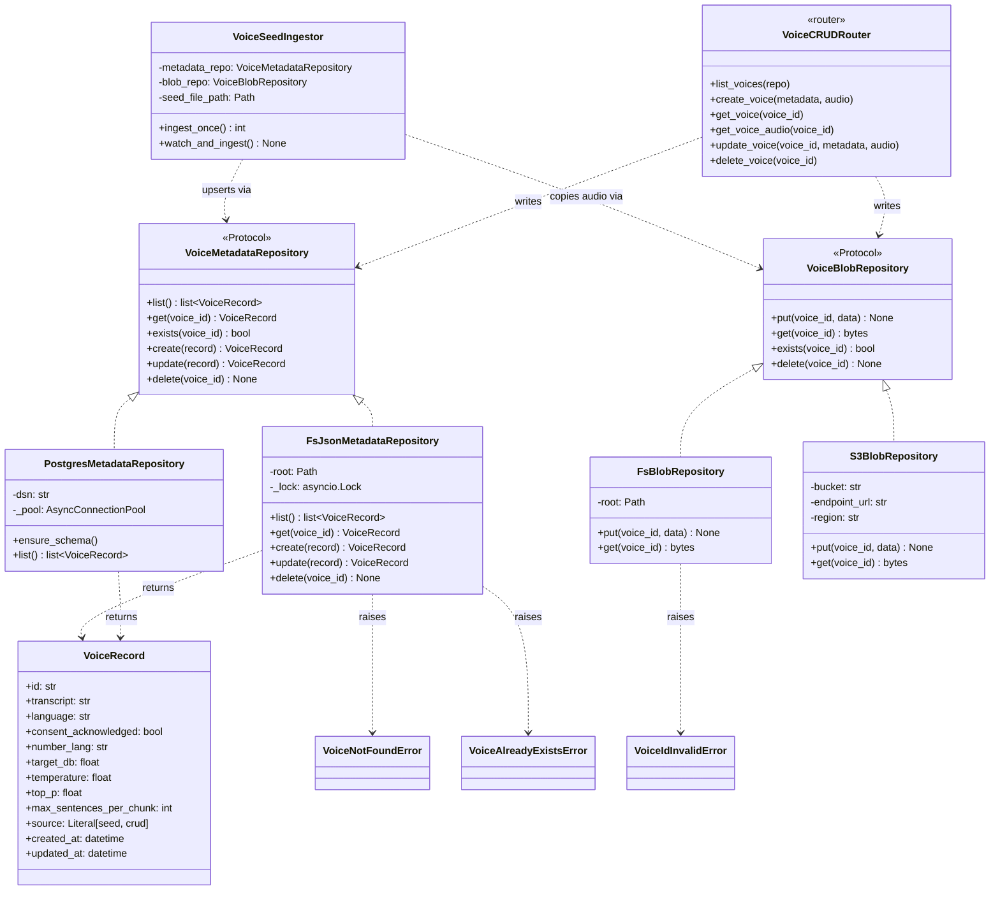

# llm-tts-api — Voice Store

## Purpose
Captures the voice-store persistence layer introduced in Sprint 3 (S-022..S-025). Two Protocols (`VoiceMetadataRepository` + `VoiceBlobRepository`) define the shape; three backend families (FS / Postgres / S3) implement them; the seed ingestor (S-011) and the CRUD router (S-025) are the two producers; `synthesize_core` is the consumer.

## Participants
- `VoiceMetadataRepository`, `VoiceBlobRepository` (Protocols) — `src/llm_tts_api/services/voice_store/protocols.py:18-95`
- `VoiceRecord`, `validate_voice_id`, `VOICE_ID_PATTERN` — `services/voice_store/records.py`
- FS metadata — `FsJsonMetadataRepository` — `services/voice_store/fs_json_metadata.py`
- FS blobs — `FsBlobRepository` — `services/voice_store/fs_blob.py`
- Postgres metadata — `PostgresMetadataRepository` — `services/voice_store/postgres_metadata.py`
- S3 blobs — `S3BlobRepository` — `services/voice_store/s3_blob.py`
- `VoiceSeedIngestor` — `services/voice_store/seed_ingestion.py:58-180`
- Errors — `VoiceNotFoundError`, `VoiceAlreadyExistsError`, `VoiceIdInvalidError` — `services/voice_store/errors.py`

## Narrative
Two Protocols carve the persistence boundary. `VoiceMetadataRepository` exposes async `list / get / exists / create / update / delete`; `VoiceBlobRepository` exposes async `put / get / exists / delete`. All implementations validate the id against `VOICE_ID_PATTERN = ^[a-z0-9_-]{1,64}$` before any I/O — the regex is also enforced at the Pydantic edge on POST, and `validate_voice_id` is re-applied at every `{voice_id}` URL path so a malicious id can't smuggle past the schema.

The default deployment uses `FsJsonMetadataRepository` (a single `metadata.json` under `TTS_VOICE_STORE_DIR`) plus `FsBlobRepository` (`blobs/<id>.wav` under the same root) — zero external services, no extras. Operators can switch metadata to Postgres (`TTS_VOICE_METADATA_BACKEND=postgres` + `TTS_VOICE_METADATA_DSN`, `[postgres]` extra) and/or blobs to S3 (`TTS_VOICE_BLOB_BACKEND=s3` + `TTS_VOICE_BLOB_S3_BUCKET`, `[s3]` extra) independently — the metadata and blob backends are orthogonal.

`VoiceSeedIngestor` is the producer for `source="seed"` records: it parses `TTS_VOICE_MAP_FILE` on startup, upserts metadata + copies reference audio into the configured blob backend, and then runs a `watchfiles` task in the background so file edits reload within ≤ 2 s (NFR-OP-05, FR-VM). The CRUD router is the producer for `source="crud"` records. Both producers write through the same Protocol — `synthesize_core` reads through `VoiceMetadataRepository.get(voice_id)` and `VoiceBlobRepository.get(voice_id)` without caring how the record got there.

## Diagram

## Notes
- FR-VS-01..12 are the producer/consumer contract; the Protocols enforce that both seed and CRUD writes go through the same surface.
- Seed runtime mechanics: [../sequence/voice-seed-ingestion.md](../sequence/voice-seed-ingestion.md).
- CRUD runtime: [../sequence/voice-crud.md](../sequence/voice-crud.md).
- `validate_voice_id` is the single source of truth for path-traversal rejection — the Pydantic edge defers to the same regex (`VOICE_ID_PATTERN`).
- The metadata and blob backends are wired independently by `dependencies.build_default_dependencies`; selecting one S3 + one Postgres is a supported deployment.
