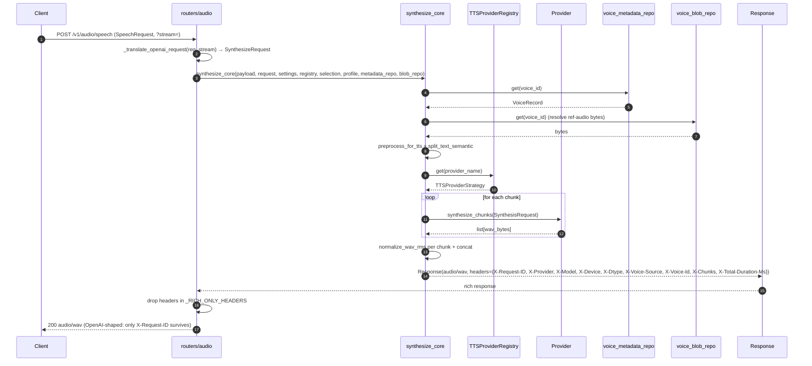

# TTS — `POST /v1/audio/speech` (thin translator over `synthesize_core`)

## Purpose
End-to-end path for the OpenAI-compatible endpoint. Post-S-017, `routers/audio.py::create_speech` is a thin translator: it maps `SpeechRequest → SynthesizeRequest`, delegates to the shared `synthesize_core`, then strips rich-endpoint-only response headers so the wire shape stays byte-identical to OpenAI (FR-OA-01..03; NFR-PT-03b paired UAT).

## Participants
- `create_speech` — `src/llm_tts_api/routers/audio.py`
- `_translate_openai_request` — `routers/audio.py`
- `_RICH_ONLY_HEADERS` — `routers/audio.py:51-62`
- `synthesize_core` — `src/llm_tts_api/services/synthesize_service.py`

## Narrative
The router receives a `SpeechRequest` and a `?stream=` query flag. `_translate_openai_request` maps the OpenAI field set onto the rich `SynthesizeRequest` (`model → model`, `input → input`, `voice → voice`, `provider → provider`, `response_format → response_format`, `normalize_db → normalize_db`, etc.). The translated payload is handed to `synthesize_core`, which runs the same pipeline that backs the rich endpoint (validation → voice lookup → preprocessing → chunking → provider synthesis → RMS normalize → optional stream/buffer). On return, the handler removes every header in `_RICH_ONLY_HEADERS` (`X-Provider`, `X-Model`, `X-Device`, `X-Dtype`, `X-Voice-Source`, `X-Voice-Id`, `X-Chunks`, `X-Total-Duration-Ms`) so the response shape matches OpenAI's wire contract.

`tests/test_openai_adapter.py` pins this with a static check that the OpenAI handler does NOT import `SpeechSynthesizer` or `routers.synthesize` internals, and `tests/test_openai_adapter_parity.py::test_paired_byte_identity_strict` asserts that an OpenAI request and the equivalent rich request produce byte-identical audio (RISK-8 relaxation contract pinned in `docs/perf/baseline.md`).

## Diagram

## Notes
- The OpenAI handler MUST NOT import `SpeechSynthesizer` or `routers.synthesize` — UAT-OA-03 enforces this with a static check.
- See [synthesize-rich.md](synthesize-rich.md) for the rich-endpoint variant of the same pipeline (where the headers are kept and streaming is exercised).
- The byte-identity invariant is pinned by `tests/test_openai_adapter_parity.py` (strict path on the deterministic in-process FakeTTSProvider; relaxed path pinned in `docs/perf/baseline.md` for non-deterministic providers).
