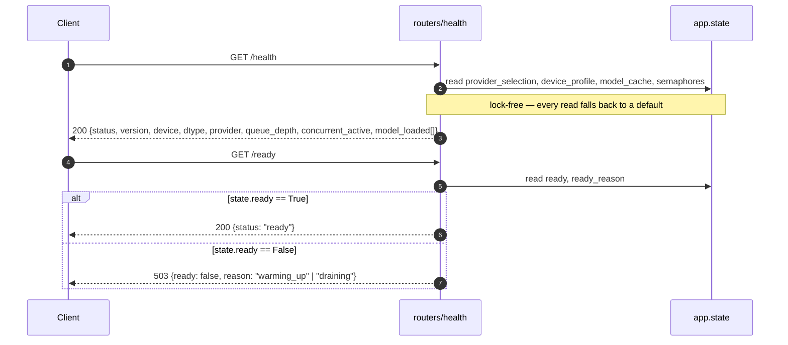

# TTS — Health & Readiness

## Purpose
Two distinct probes. `/health` is a **lock-free** liveness check (FR-HL-01) that never blocks on a singleton; `/ready` is the orchestrator readiness gate (FR-HL-02) backed by the `app.state.ready` flag the lifespan toggles after warmup + seed ingestion.

## Participants
- `health`, `ready` — `src/llm_tts_api/routers/health.py`
- `_semaphore_used` helper — `routers/health.py:32-45`
- `app.state` (populated by the lifespan / test fixture) — `main.py`

## Narrative
`/health` reads `app.state` defensively (every slot has a default) so the probe NEVER fails merely because the lifespan was skipped (test bypass mode). The body always carries `status` and `version`; when the lifespan has run it also reports `provider`, `provider_source` (`auto`/`env`), `device`, `dtype`, the list of loaded models, and the current `queue_depth` / `concurrent_active` derived from `Semaphore._value`.

`/ready` returns 200 only when `app.state.ready == True`. The lifespan sets the flag False at process start, flips it True after the warmup + seed pass, and back to False (with `ready_reason="draining"`) in the shutdown `finally` block. 503 responses include the `reason` (`warming_up` or `draining`) so an orchestrator can distinguish startup from shutdown.

## Diagram

## Notes
- Use `/health` as the Kubernetes **liveness** probe and `/ready` as the **readiness** probe — `/health` will keep returning 200 even during graceful drain (the process is alive), while `/ready` switches to 503 to stop new traffic.
- `queue_depth` and `concurrent_active` are derived from the internal `Semaphore._value` counter; the value is clamped at 0 so a transient race during slot release can't surface as a negative number.
- The `provider_source` field is the easiest way to confirm whether the running process took the env-override path (`TTS_PROVIDER=...`) or auto-selection.
