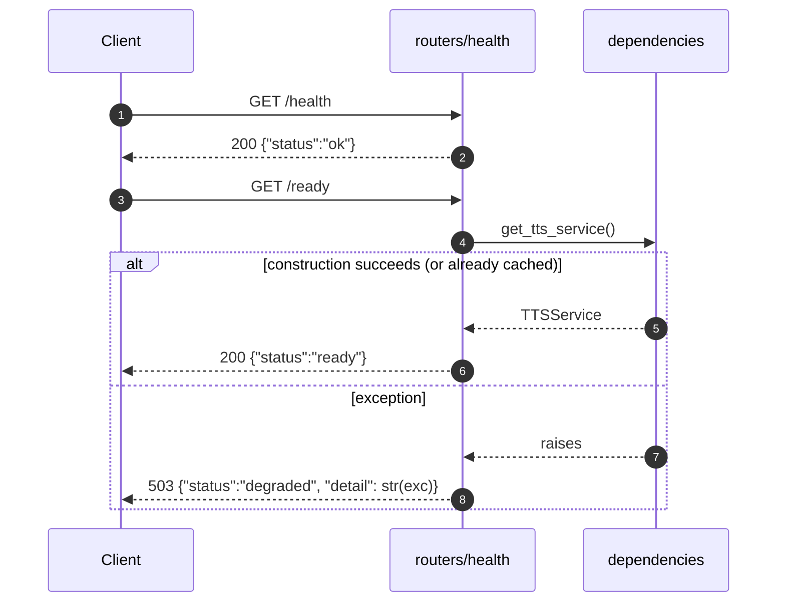

# TTS — Health & Readiness

## Purpose
Two distinct probes: `/health` is an instant liveness check, `/ready` exercises the DI chain to confirm the service is initialized.

## Participants
- `health`, `ready` — `src/llm_tts_api/routers/health.py:6-22`
- `dependencies.get_tts_service` — `dependencies.py:27-34`

## Narrative
`/health` returns `{"status":"ok"}` synchronously without touching any service — it confirms only that the ASGI worker can answer. `/ready` calls `get_tts_service()`; on the cached path this is effectively free, but on the very first request it triggers the startup chain (see [startup.md](startup.md)) and may take seconds. If construction fails, the catch returns `503 degraded` with the exception text rather than letting the exception escape.

## Diagram

## Notes
- The `/ready` probe is intentionally heavy — a Kubernetes liveness probe should use `/health`, readiness should use `/ready`.
