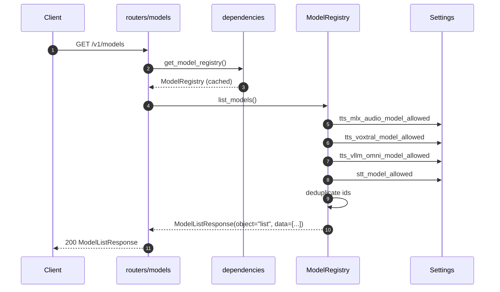

# TTS — List Models (GET /v1/models)

## Purpose
Resolve the union of allowed TTS models across providers plus the STT model list, return them in OpenAI's model-list envelope.

## Participants
- `list_models` — `src/llm_tts_api/routers/models.py:13-16`
- `ModelRegistry.list_models` — `services/model_registry.py:14-23`
- `Settings.tts_*_model_allowed`, `Settings.stt_model_allowed` — `config.py`

## Narrative
The handler depends on `get_model_registry`, which is a singleton bound to the cached `Settings`. `list_models` collects all allowlists, deduplicates, and emits a `ModelListResponse` with one `ModelObject` per id. There is no I/O.

## Diagram

## Notes
- Models from disabled providers still appear if their allow-list env var is populated; the registry doesn't filter by active provider.
