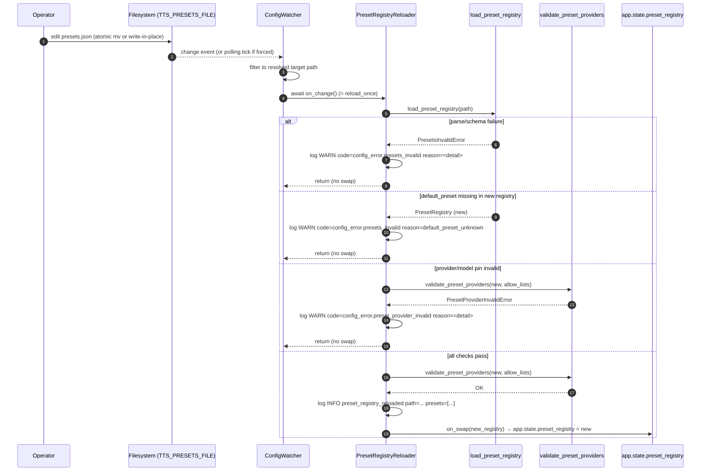

# TTS — Preset hot-reload (S-029)

## Purpose
Trace one edit of `TTS_PRESETS_FILE` from the filesystem event through validation to the atomic swap of `app.state.preset_registry`. On any validation failure the prior registry stays live and a single WARN line is emitted (NFR-SE-10 attack tolerance); a malformed edit can never bring the service down.

## Participants
- `ConfigWatcher` — `src/llm_tts_api/services/config_watcher.py` (the generic watch/dispatch primitive shared with S-011 seed ingestion).
- `PresetRegistryReloader` — `src/llm_tts_api/services/presets/reloader.py`
- `load_preset_registry`, `validate_preset_providers` — `src/llm_tts_api/services/presets/config.py`
- `_allow_lists_from_settings` — `src/llm_tts_api/services/presets/startup.py`
- `app.state.preset_registry` — set + atomically replaced by lifespan / reloader.

## Narrative
The lifespan constructs `PresetRegistryReloader` once and spawns its `watch()` coroutine as a background task. `watch()` instantiates a `ConfigWatcher` for `settings.tts_presets_file` and awaits its `awatch()` loop (or polling loop when `TTS_PRESETS_WATCH_FORCE_POLLING=1` is set, per RISK-3). On every detected file mtime change the watcher calls `reload_once()`.

`reload_once()` re-runs the parse + schema validation (`load_preset_registry`), then checks the default preset is still defined, then runs the FR-PR-13 provider/model allow-list cross-check (`validate_preset_providers`) against `_allow_lists_from_settings`. The file-permission check (`check_presets_file_permissions`) is intentionally **skipped** here — it is startup-only per NFR-OP-PR-3 / RISK-PR-3; the hot-reload path accepts the documented `mv` + `chmod` race window.

If every check passes, `on_swap(new_registry)` is invoked synchronously — the lifespan binds this callback to `app.state.preset_registry = new_registry` so the swap is atomic from a reader's perspective (in-flight requests keep their previously-captured snapshot per [`preset-resolution.md`](preset-resolution.md)). On any failure a single WARN line is logged with the `config_error.*` code key and field-path detail; the prior registry remains live and the watcher continues. Callback exceptions are swallowed by `ConfigWatcher` so a downstream bug never crashes the task.

## Diagram

## Notes
- The watcher watches the **parent directory**, not the file itself, because editors that "save" via `rename` + `replace` would otherwise drop their event on a single-file watch.
- `awatch` is awaited inside a `try / except asyncio.CancelledError: raise / except Exception: logger.exception(...)` envelope so a transient OS error cannot kill the task; cancellation (lifespan shutdown) is the only path that exits the loop normally.
- The reloader does NOT itself touch `app.state` — it calls `on_swap`, which the lifespan wires to the slot. Tests instantiate the reloader with a captured-list `on_swap` to assert behavior independently of FastAPI.
- File permissions: hot-reload deliberately does NOT re-run `check_presets_file_permissions`. This is the documented limitation pinned in [`../class/presets.md`](../class/presets.md) and `docs/specs/risks.md` RISK-PR-3.
- Related: producer-side at [`preset-resolution.md`](preset-resolution.md); seed-map hot-reload (the parallel S-011 loop using the same `ConfigWatcher`) at [`voice-seed-ingestion.md`](voice-seed-ingestion.md).
