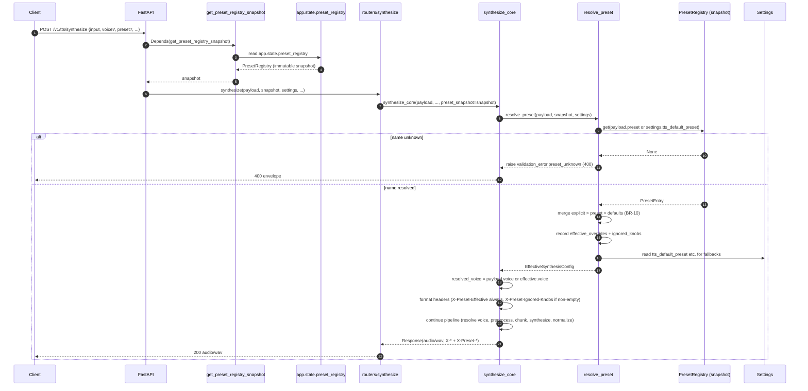

# TTS — Preset resolution at request time (S-028)

## Purpose
Trace one synthesis request from FastAPI dependency injection through `resolve_preset` to the merged `EffectiveSynthesisConfig` that feeds `synthesize_core`. The resolution is **pure**: it consumes only the request body, a request-scoped `PresetRegistry` snapshot, and `Settings`. The snapshot is captured once at request-entry — a mid-flight hot-reload swap on `app.state.preset_registry` cannot tear this resolution (NFR-PR-04).

## Participants
- `synthesize` (and `create_speech` after translation) — `src/llm_tts_api/routers/{synthesize,audio}.py`
- `get_preset_registry_snapshot` — `src/llm_tts_api/dependencies.py`
- `resolve_preset`, `_format_preset_effective_header`, `synthesize_core` — `src/llm_tts_api/services/synthesize_service.py`
- `PresetRegistry`, `PresetEntry` — `src/llm_tts_api/services/presets/config.py`

## Narrative
FastAPI's `Depends` machinery resolves `get_preset_registry_snapshot(request)` exactly once at request entry, binding the current `app.state.preset_registry` to a local. The router hands this snapshot, together with the `SynthesizeRequest` and `Settings`, to `synthesize_core`. `synthesize_core` immediately calls `resolve_preset` to compute an `EffectiveSynthesisConfig`. The resolver applies precedence per BR-10 (explicit request field > preset defaults > Settings / VoiceRecord defaults), populates `effective_overrides` for any explicit-vs-preset conflict (logged at WARN), and appends knobs the pipeline cannot honor to `ignored_knobs`.

After resolution `synthesize_core` formats `X-Preset-Effective` (always) and `X-Preset-Ignored-Knobs` (only when non-empty) into the success-response headers. If `payload.voice` is unset, the resolved `effective.voice` is used as fallback before the `voice_required` envelope is raised (HF-2 / FR-PR-03). The OpenAI-adapter response strips both preset headers at the boundary (`_RICH_ONLY_HEADERS` in `routers/audio.py`).

## Diagram

## Notes
- The resolver MUST NOT re-read `app.state.preset_registry` — the snapshot is the contract surface. The constraint is documented on `get_preset_registry_snapshot`'s docstring and pinned by `tests/test_preset_resolution.py` parity tests.
- `X-Preset-Effective` has the shape `<name>(field=value,...)` with sorted keys. `effective_overrides` is the list of *explicit-over-preset* fields and is logged at WARN by `_pick`, but is encoded into the same header for client visibility (FR-PR-08).
- `X-Preset-Ignored-Knobs` is **comma-separated and order-stable**; today's only producer is the `response_format` soft-ignore (the rich pipeline accepts only WAV until S-033). New ignored-knob producers must append to the tuple, never insert in the middle (test pins the shape).
- The OpenAI adapter calls the same `synthesize_core` and runs the same resolver, then strips both preset headers from the outbound response so its wire shape stays OpenAI-identical (NFR-PT-03b paired UAT).
- Related: [`preset-hot-reload.md`](preset-hot-reload.md) for the producer side; [`synthesize-rich.md`](synthesize-rich.md) for the rest of the pipeline; class shape in [`../class/presets.md`](../class/presets.md).
