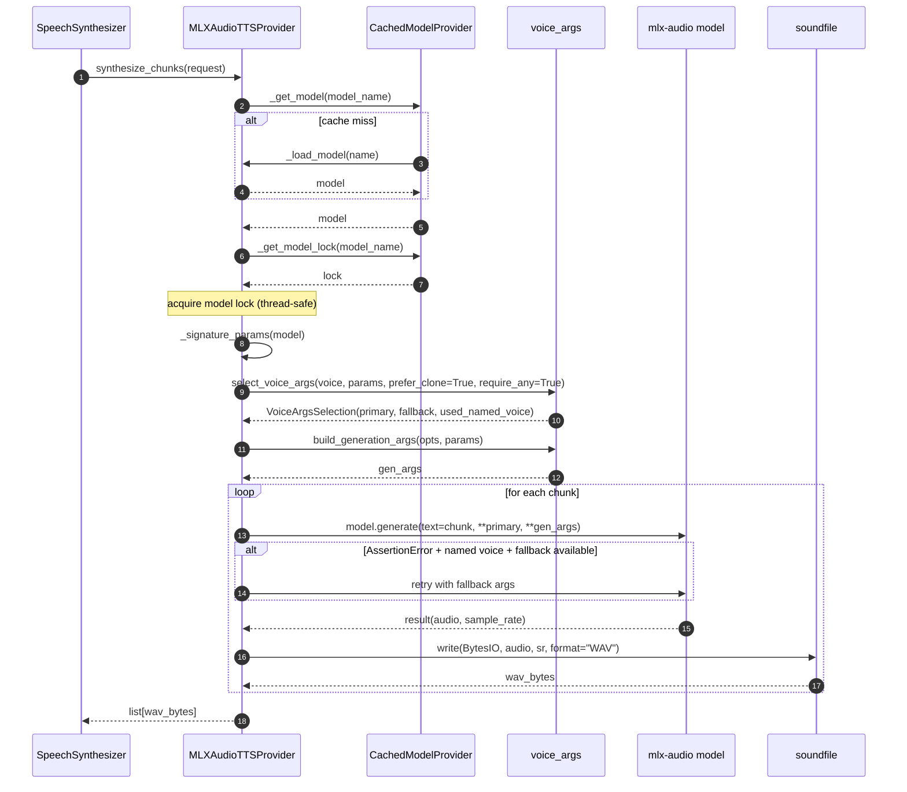

# TTS — MLX Audio Provider Synthesis

## Purpose
Per-chunk synthesis with `mlx-audio`. Supports both reference-audio cloning and named voices, with an `AssertionError` clone fallback for models that disagree about supported kwargs.

## Participants
- `MLXAudioTTSProvider` — `services/tts_providers/mlx_audio_provider.py:20-115`
- `CachedModelProvider._get_model`, `_get_model_lock` — `cached_model_provider.py:16-49`
- `voice_args.select_voice_args`, `build_generation_args` — `voice_args.py:59-101`

## Narrative
`synthesize_chunks` first resolves (and caches) the model under a per-model `threading.Lock`. Inspecting `inspect.signature(model.generate).parameters` lets the provider only pass kwargs the model actually accepts. The voice-args helper produces a primary args dict (cloning preferred) and a fallback dict (named voice → ref audio). For each chunk, the provider calls `model.generate(**args)`; on `AssertionError`, if a named voice was used and a clone fallback is available, it retries with the fallback. Audio samples come back, `soundfile.write` to a `BytesIO` produces the chunk's WAV bytes.

## Diagram

## Notes
- Used when `Settings.tts_provider == "mlx_audio"`.
- The fallback retry is the only place a provider second-guesses its voice selection.
