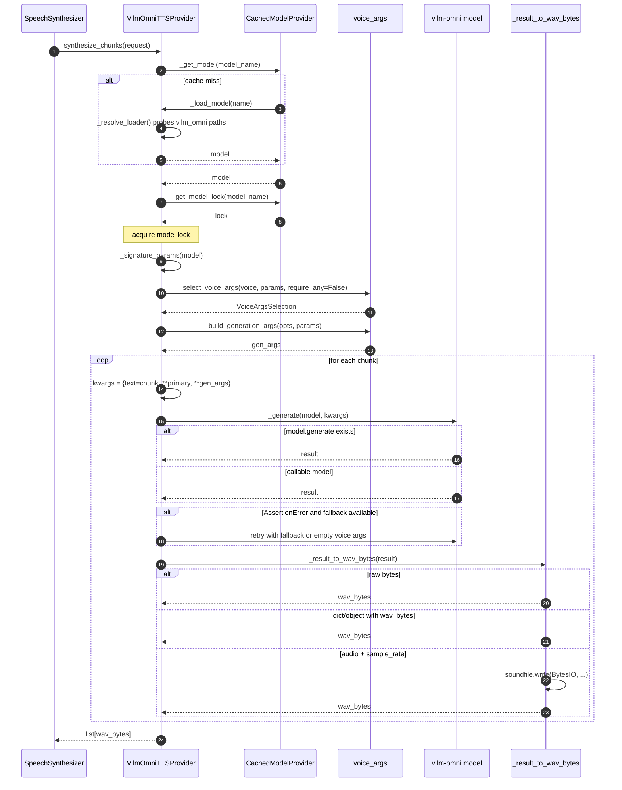

# TTS — vLLM Omni Provider Synthesis

## Purpose
Most flexible of the three providers: tolerates multiple loader import paths, optional voice, multiple possible result payload shapes, and falls back on `AssertionError`.

## Participants
- `VllmOmniTTSProvider` — `services/tts_providers/vllm_omni_provider.py:21-199`
- `CachedModelProvider` — `cached_model_provider.py:16-49`
- `voice_args.select_voice_args`, `build_generation_args` — `voice_args.py:59-101`

## Narrative
Loading uses `_resolve_loader` which probes a list of import paths (`vllm_omni.tts.utils.load`, `vllm_omni.tts.load`, `vllm_omni.load`). Voice selection uses `require_any=False`, so chunks may be generated with no voice args at all (model default voice). `_generate` tries `model.generate(**kwargs)` first, falling back to `model(**kwargs)` if generate is missing but the model is callable. Results are decoded by `_result_to_wav_bytes`, which dispatches on whether the payload is raw `bytes`, has `wav_bytes`, or is a `(audio, sample_rate)` pair.

## Diagram

## Notes
- Used when `Settings.tts_provider == "vllm-omni"` (note hyphen).
- The "no voice args" branch is what lets vLLM Omni serve default-voice prompts without any user `VoiceConfig` content beyond the entry existing.
