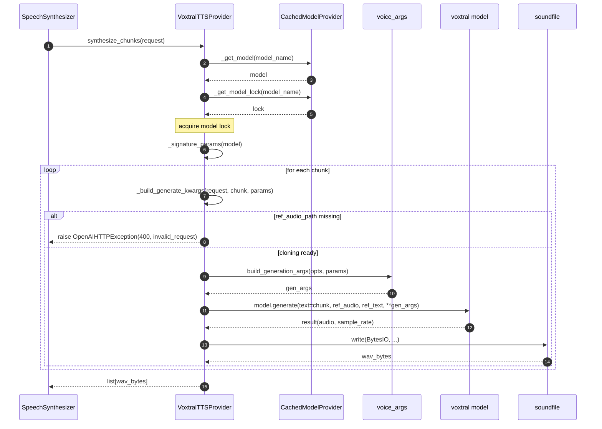

# TTS — Voxtral Provider Synthesis

## Purpose
Cloning-only synthesis path. Voxtral rejects named-voice mode by policy and requires `ref_audio_path` + `ref_text` for every call.

## Participants
- `VoxtralTTSProvider` — `services/tts_providers/voxtral_provider.py:16-93`
- `CachedModelProvider` — `cached_model_provider.py:16-49`
- `voice_args.build_generation_args` — `voice_args.py:86-101`
- `errors.invalid_request` — `errors.py:37`

## Narrative
The provider loads/caches the model and acquires its lock identically to MLX Audio. The difference is in `_build_generate_kwargs`: if `voice.ref_audio_path` is empty it raises `invalid_request("Voxtral requires voice cloning")`. Otherwise it builds `{text, ref_audio, ref_text, **gen_args}` and calls `model.generate`. No fallback path; first error escapes.

## Diagram

## Notes
- Used when `Settings.tts_provider == "voxtral"`.
- The cloning-only policy is enforced at synthesis time, not at config load — a voice without `ref_audio_path` will only fail when actually used.
