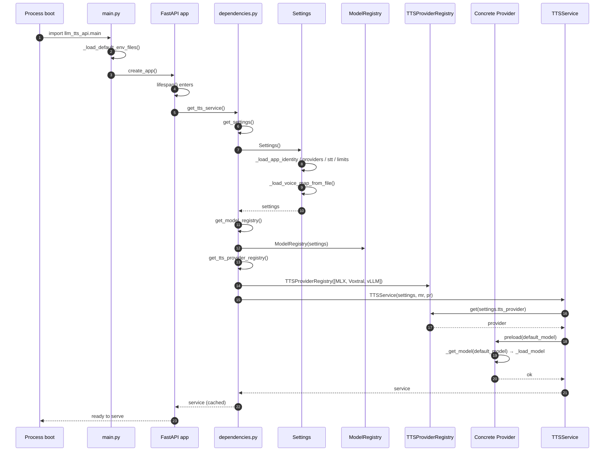

# TTS — Startup & DI Wiring

## Purpose
Show the order of operations when `main.py` loads: env files → app factory → lifespan triggers `get_tts_service`, which transitively constructs the LRU-cached singleton chain and preloads the default model.

## Participants
- `main._load_default_env_files`, `main.create_app` — `src/llm_tts_api/main.py:23-83`
- DI getters — `src/llm_tts_api/dependencies.py:15-52`
- `Settings.__post_init__` — `config.py:63-69`
- `TTSProviderRegistry` ctor — `services/tts_providers/registry.py`
- `TTSService.__init__` — `services/tts_service.py:244-267`
- `CachedModelProvider.preload` — `services/tts_providers/cached_model_provider.py:46-48`

## Narrative
On import, `main.py` loads `.env` and `.env.local` (best effort). Uvicorn invokes the FastAPI lifespan, which calls `get_tts_service()`. Because that getter is `@lru_cache(maxsize=1)`, the first call cascades through `get_settings`, `get_model_registry`, and `get_tts_provider_registry`. The provider registry instantiates all three concrete providers eagerly but the providers themselves only load models lazily — except for `TTSService.__init__`, which calls `provider.preload(default_model)` so the chosen provider's default model is warm when traffic arrives.

If any constructor raises (e.g., a missing `TTS_VOICE_MAP_FILE`), the lifespan propagates the exception and uvicorn aborts startup.

## Diagram

## Notes
- All singletons remain cached for process lifetime.
- The model load can be slow on first start (cold weights); subsequent requests skip this path.
- See [create-speech.md](create-speech.md) for the request-time use of these singletons.
