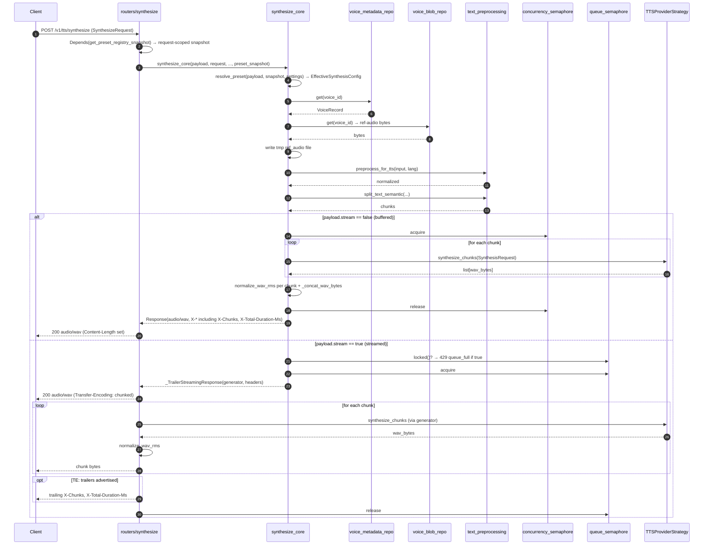

# TTS — `POST /v1/tts/synthesize` (buffered + streamed)

## Purpose
The rich endpoint runs the same `synthesize_core` as the OpenAI adapter but keeps every response header and exposes the streaming branch. Two variants are diagrammed below: **buffered** (default, `stream=false`) and **streamed** (`stream=true`, optional trailing headers per G-3).

## Participants
- `synthesize` router handler — `src/llm_tts_api/routers/synthesize.py`
- `synthesize_core`, `_run_synthesis`, `_stream_synthesis_chunks`, `_TrailerStreamingResponse`, `_client_advertises_trailers` — `src/llm_tts_api/services/synthesize_service.py`
- `preprocess_for_tts`, `split_text_semantic` — `services/text_preprocessing.py`
- `normalize_wav_rms`, `_concat_wav_bytes`, `_wav_duration_ms` — `services/audio_postprocessing.py` + `synthesize_service.py`
- `app.state.concurrency_semaphore`, `queue_semaphore`, `model_locks` — set by lifespan

## Narrative
Both variants share the **resolve phase**. First, `Depends(get_preset_registry_snapshot)` binds the current `app.state.preset_registry` to the request and `resolve_preset(payload, snapshot, settings)` merges request fields on top of the named preset's defaults to produce an `EffectiveSynthesisConfig` (precedence per BR-10; unknown preset → 400 `preset_unknown`). The resolved config drives the rest of the pipeline: validate `voice` non-null (falling back to `effective.voice` per HF-2 / FR-PR-03), look up the `VoiceRecord` through `voice_metadata_repo.get()`, fetch the reference-audio bytes through `voice_blob_repo.get()`, materialise them into a temp file, run `preprocess_for_tts` (date/number expansion, punctuation cleanup), and split into chunks via `split_text_semantic` honouring `TTS_MAX_INPUT_CHARS` and the voice's `max_sentences_per_chunk`. The success-response header set always carries `X-Preset-Effective`; `X-Preset-Ignored-Knobs` is added when non-empty (FR-PR-08 / FR-PR-09).

**Buffered (stream=false).** `_run_synthesis` acquires the concurrency semaphore, iterates over chunks against the chosen provider strategy, normalises each chunk's RMS, concatenates them into a single WAV body, and returns it with the full `X-*` header set including `X-Chunks` + `X-Total-Duration-Ms`.

**Streamed (stream=true).** First check `queue_semaphore.locked()`: if the queue is full, raise `capacity_error.queue_full` (429) before any work. Otherwise acquire the queue slot and return a `_TrailerStreamingResponse` that yields normalised chunk bytes as they're produced by `_stream_synthesis_chunks`. The header set is the same minus the trailer-only fields (`X-Chunks`, `X-Total-Duration-Ms`); those are emitted as **trailing** headers if and only if the client advertises `TE: trailers` and uvicorn supports it. Otherwise (G-3) the service simply omits the two trailer fields — never emits synthesised values, never blocks the stream waiting for chunk-count finality.

## Diagram

## Notes
- The rich endpoint keeps every `X-*` header; the OpenAI adapter strips a subset (see [create-speech.md](create-speech.md)).
- The `queue_full` check happens BEFORE acquiring the queue slot, so a saturated queue rejects new streamed requests immediately (no head-of-line blocking).
- Both variants honour `TTS_INFERENCE_TIMEOUT_SECONDS` via an `asyncio.wait_for` wrapper inside the synthesis loop when configured (S-007 / S-010).
- The OpenAI adapter ([create-speech.md](create-speech.md)) follows the same flow with the response-header strip on top (`X-Preset-Effective` + `X-Preset-Ignored-Knobs` are part of `_RICH_ONLY_HEADERS` and get stripped at the boundary).
- Preset-resolution detail (precedence, headers, hot-reload tear-free guarantee): [preset-resolution.md](preset-resolution.md). Hot-reload producer side: [preset-hot-reload.md](preset-hot-reload.md). Class shape: [../class/presets.md](../class/presets.md).
