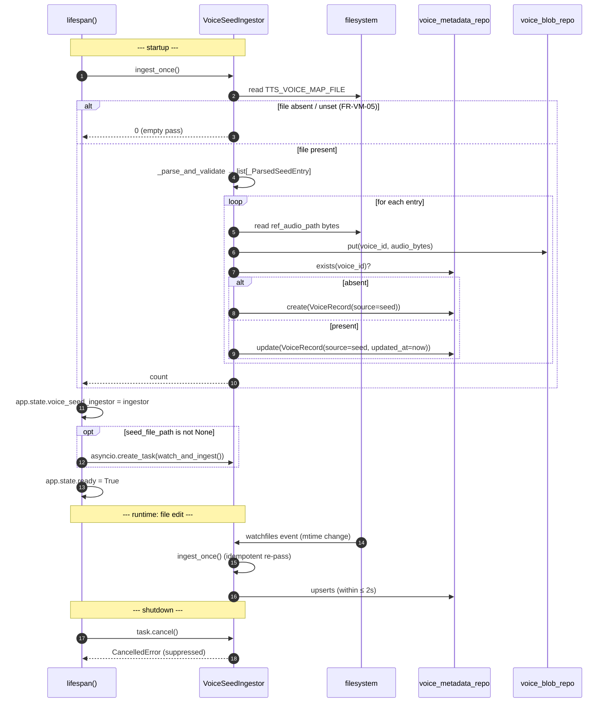

# TTS — Voice Seed Ingestion (S-011) + watchfiles hot-reload (NFR-OP-05)

## Purpose
Captures the seed-ingestion mechanism that turns `TTS_VOICE_MAP_FILE` (a JSON document of `voice_map.json` entries) into rows in the voice store at startup and keeps them in sync on file edits (≤ 2 s, NFR-OP-05).

## Participants
- `VoiceSeedIngestor.ingest_once`, `watch_and_ingest` — `services/voice_store/seed_ingestion.py`
- `_parse_and_validate`, `_validate_entry` — `seed_ingestion.py`
- `resolve_seed_file_path`, `force_polling_from_env` — `seed_ingestion.py`
- `VoiceMetadataRepository`, `VoiceBlobRepository` — see [../class/voice-store.md](../class/voice-store.md)

## Narrative
On startup the lifespan calls `voice_seed_ingestor.ingest_once()` BEFORE flipping `ready=True`, so the first `GET /v1/tts/voices` reflects the seed file (UAT-VM-01). The ingestor parses every entry, validates the required fields (`ref_audio_path`, `ref_text`, `language`, etc.), copies the reference-audio bytes into the configured blob backend, and upserts the metadata record with `source="seed"`. Entries that fail validation raise — the lifespan propagates the failure and uvicorn aborts startup so misconfiguration cannot defer to the first request.

If `TTS_VOICE_MAP_FILE` is set (`seed_file_path is not None`), the lifespan also spawns `watch_and_ingest()` as a background task. That task uses `watchfiles` to watch the file's mtime; on any change it re-runs `ingest_once()` within ≤ 2 s (NFR-OP-05, G-2). The task is cancelled in the lifespan's `finally` block; `asyncio.CancelledError` is suppressed during teardown.

Setting `TTS_VOICE_MAP_WATCH_FORCE_POLLING=1` forces the watcher into polling mode (some filesystems — certain bind mounts, network shares — don't deliver native change events reliably).

## Diagram

## Notes
- Seed ingestion is **idempotent**: re-running `ingest_once()` on an unchanged file is a no-op; on a changed file it upserts only the touched ids.
- CRUD writes (`source="crud"`) and seed writes (`source="seed"`) share the same id namespace — a seed entry with the same id as a CRUD record will overwrite it. This is intentional: the seed file is the operator's configuration source of truth for any id it names.
- Reference audio files are validated for readability at ingestion; the bytes are **copied** into the blob backend (FR-PV-05) so the seed file is no longer load-bearing after startup.
- See [../class/voice-store.md](../class/voice-store.md) for the persisting Protocols and [voice-crud.md](voice-crud.md) for the CRUD producer.
